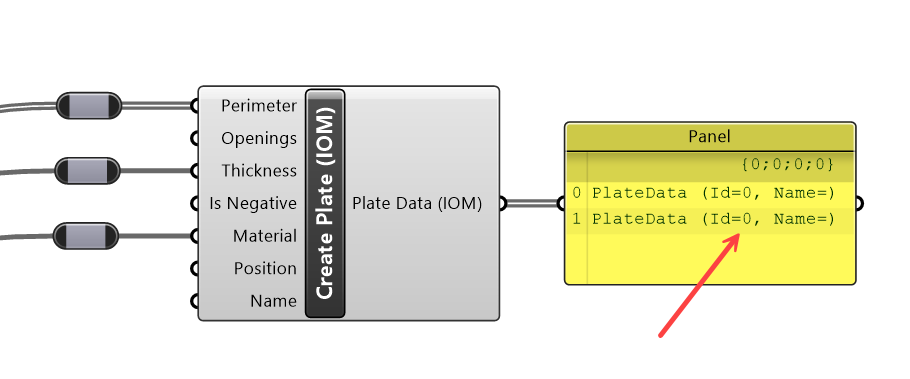
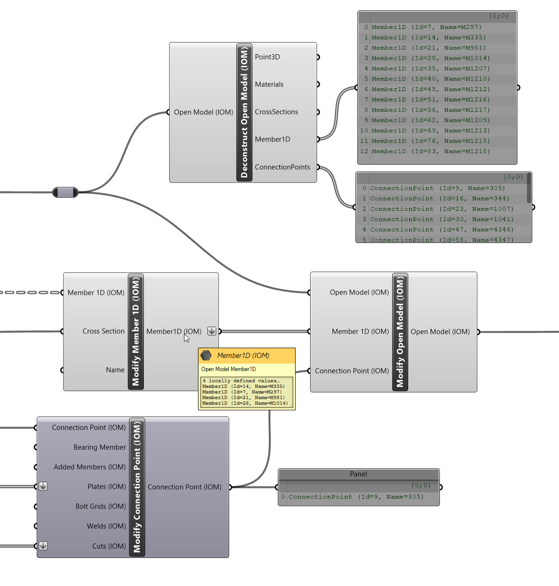

# Open Model Components

The Open Model Components in Grasshopper allow users to interact flexibly with IDEA Open Model (IOM) in the Grasshopper environment. 

IDEA Open Model is IDEA StatiCa’s own interoperability framework and open file format. It is defined as a modulated .Net (C#) class structure and used to describe FEA or BIM models and designed and developed to interact natively with IDEA StatiCa Apps.

It is good to have a basic understanding on the make-up of IDEA Open Model to understand how the components should work together. For more information on IDEA Open Model please refer to [Open Model Documentation](../../iom/iom_getting_started.md).

## Component Overview

Open Model components can be split into three categories:
* **Object Components** – Object components relate to creation or modification of modulated Open Model objects that can be then assigned to a Model. 
* **Compiling Components** – Compiling components relate to compiled models, results or connection data which can be saved and then imported into IDEA StatiCa Apps. These components have assigned databases of assigned objects. 
* **Common Components** – Other components which are used throughout.

# Open Model Object Components

Object components relate to a specific object type in the Open Model data format. Some examples are Materials, Cross-sections, Member, Load Case, Plate, Weld etc.

## Open Model Object Component Types

There are five sub-types of components that relate to Open Model objects, these are: **Create**, **Deconstruct**, **Modify**, **View**, **Inspect**.

**Component Type** | **Description** 
------------|----------
 **Create** | Creates a new Open Model object of the prescribed type
 **Modify** | Break down an object into its components and references and provides information about the Object. This typically is useful for imported objects.
 **View** | Modifies a previously created object. Modify components allow certain object properties to be updated. The modify object creates a copy of the object with changes properties. 
 **Inspect** | IOM Objects can be serialised into XML, and to a lesser extent JSON. The Inspect components allows the User to get the XML string representation of any IDEA IOM Object.

## Object Creation

All Open Model Objects are required to have an Id and Name. To make object creation quicker, and to improve usability most physical objects do not require a user defined id or name, and can be left to be assigned automatically when they are added and compiled to a model. 

Objects that do not have an Id or Name assigned automatically get assigned an Id = 0 and an Empty Name string. 

When using a Create component the output should show the Name and Id provided to that object. The output string is the Open Model Object Type.

> [!IMPORTANT]
> When creating objects in Grasshopper the object **Name should be a Unique** string for a particular object type.

> [!NOTE]
> Some specific objects like materials, cross-sections, load cases and combinations do **require a name** on object creation. 

# Object Components (Model/Model Result)

Objects are floating single entities until they are added/assigned to a Compiled Object. A compiled object is simply an object which holds lists of single objects. In most instances this relates to an Open Model or Open Model Result. 

Here we will describe Open Model and Open Model Results as Compiled Objects, however this term is interchangeable between Model or Model Result or any other of the compiled objects which are described below. 

> [!IMPORTANT] 
> Objects need to be assigned to a compiled object before they can be transferred to and from IDEA StatiCa applications.

## Compiled Objects

The primary compiled object types are:
* **Open Model**
* **Open Model Result**
* **Connection Data** (Connection Data is also stored under Open Model but can be transferred as its own entity)

These objects can be exported as XML and then imported into the IDEA StatiCa Connection App. 

> [!NOTE]
> **Any number** of compiled objects can be on the canvas at any one time, making it an extremely flexible way of managing different models and results at the same time. 

### Compiled Object Component Sub Types

There are five sub-types of components that relate to Model component: These are **Import**, **Convert**, **Create**, **Deconstruct**, **Modify**, **Save**, and **Inspect**.

**Component Type** | **Description** 
------------|----------
 **Import (XML)** | This allows you to import an existing saved XML file format of a Compiled Object. You can import the XML definition for several different OpenModel formats. Such as OpenModel, OpenModelResult, OpenModelContainer and ModelBIM.
 **Convert** | Convert allow direct conversion of some other CAD or FEA formats to IOM directly inside of Grasshopper.
 **Create** | Create a new OpenModel with your desired settings.
 **Deconstruct** | Break down a model to see all the assigned objects within it.  For a model this is useful to inspect the Members, Materials, Cross-sections within it.
 **Modify** | Modify a Created or Imported OpenModel. This is the primary component used to add or update objects in a created OpenModel. This is explained in further detail below.  
 **Save** | Save XML allows you to save OpenModel, OpenModelResult, and ModelBIM format to an XML file on disk. 
 **Inspect** | Open Models can also be inspected for the entire XML output of the constructed model.

### Modifying a Model

The modify component follows typical Grasshopper logic, by first creating a duplicate of the input Model and then updating the duplicate with the provided modifications.

Each modify component has inputs for the objects which can be explicity added or updated in the provided model. The input first checks whether the provided object exists in the model **(by its Name)** and if so, is replaced with the updated object provided. If the object is not present in the model, it is added to the model. 

The image below demonstrates updating a set of Members and a Connection Point which is already defined in an existing Model. 

In this instance there is already a list of Members and Connection Points assigned in the Model. Here we want to update the cross-sections of 4 of the existing Members so we provide the Modified Members to the explicit Add/Update input in the Modify Open Model component. The same goes for the Modify Connection Point, where we add additional Plate and Cut information to the existing Connection Point.

The same goes for objects assigned to Connection Points (as it is also a compiled object), if an object is already assigned in a connection point, then it will be updated, else it will be added to the connection point. In general, we will likely only want to add things to a connection point. 

> [!NOTE]
> Currently objects cannot be deleted from a model

### Model Compilation

Each time the Model Modify component is run the model is re-compiled. When an object is assigned to a model, a duplicate of the original object is created and assigned to the model database. **If the Id and Name of a particular object are not set previously then they are set as required to the copied object.**

**Model compilation is done in a recursive manner**, meaning, objects which are required by others are automatically added to the model if they are not already available. For example, if a member is referenced in a connection point, then that member is automatically added to the model, along with the required cross-section and material if it is not already apparent in the model. If the material is already in the Model, then a reference to that object is created. Whenever a model is recompiled, references between different objects are automatically created and the model revalidated.

Using this system allows us to reduce the number of required inputs in the Modify Model component. However, it can cause some issues if not careful.It is very important to keep Object Names unique if they represent different objects. 

> [!NOTE] 
> Objects which are typically added in a recursive manner generally have required Name inputs - such as Materials,  Cross-sections which helps reduce user errors.

### Creating Model Results

