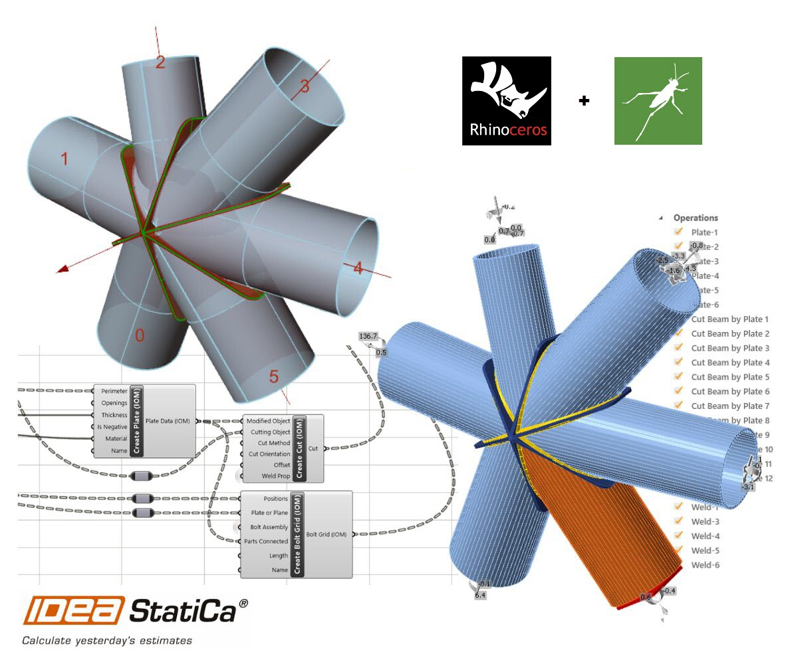

# IDEA StatiCa Grasshopper

The following section looks to introduce and provide information on the IDEA StatiCa plugin for Grasshopper3d, a visual programming package attached to the powerful modelling CAD software [Rhino3d](https://www.rhino3d.com/). 

Rhino and Grasshoppper is an powerful CAD modelling platform with a large array of plugins avaliable for the Architectural and Engineering industry. Combining Grasshopper with IDEA StatiCa's Open Model and API's creates an extremely powerful platform for the parametric definition of complex connection geometry plus the automation and optimisation of connections.

> [!CAUTION] 
> The Rhino/Grasshopper plugin for Grasshopper3d is currently WORK IN PROGRESS. Therefore, use it with care. 
> We cannot currently guarantee compatibility between each version, as the development continues to progress. 