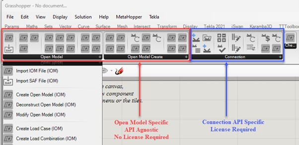

# IDEA StatiCa Grasshopper

## Prelude
IDEA StatiCa is actively developing a parametric framework for the development of complex modelling and parametric optimisation of connections and other structural details. 

The aim of the backend framework is to provide the ability for further extensions to other visual programming and CAD applications. However, Grasshopper3d has been chosen as the first implementation.

This page introduces an IDEA StatiCa plugin for Grasshopper3d, a visual programming package attached to the powerful modelling CAD software [Rhino3d](https://www.rhino3d.com/). The development of these tools is largely based on active user workflows, so please get in touch with us to discuss what you are trying to achieve with these tools. 

## Introduction

The IDEA StatiCa Grasshopper plugin consists of the following primary parts: 

1.	Components to generate IDEA Open Model (IOM). These are used to facilitate:
    * Create, Import or Modify IDEA Open Model.
    * Custom FEA Conversions
    * Geometric conversion: IOM <-> Rhino
    * Explicit modelling of members, plates, bolts, cuts, and welds.

2.	Components to interact with IDEA Design Applications. The are used to:
    * Create, import, modify design app files, such as connections.
    * Get and update geometry and components.
    * Apply user defined templates.
    * Get and update user defined parameters.
    * Run calculation and extract results.
    * Get further design information (inc. fabrication costs etc.)

Components to generate IOM are API agnostic, and therefore currently do not require a license of IDEA StatiCa.  Component that interacts with IDEA StatiCa Design App’s require an active license of IDEA StatiCa. 
Open Model components are used across Design App components in cases where geometry conversion and interoperability are concerned. 

### Qualification

The Rhino/Grasshopper plugin for Grasshopper3d is WORK IN PROGRESS and is not released as a fully working product. Therefore, use it with care. We cannot guarantee compatibility between each version, as the development will likely change rapidly in the future. 
