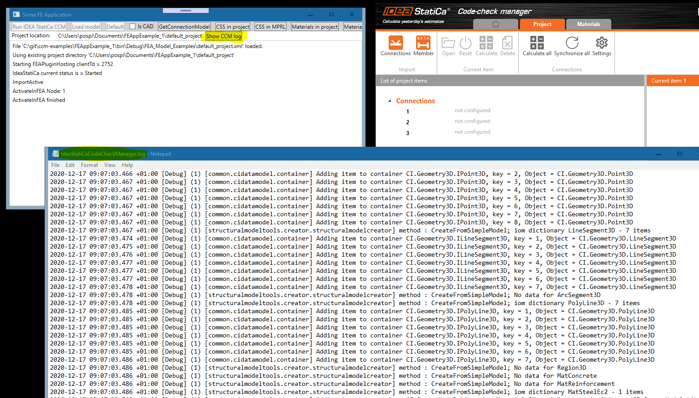

## Diagnostics in Idea CCM ##



### Setting of the severity of messages in the log file ###
The severity level of messages which are written into log file can be configured in the file **_IdeaStatica.Diagnostics.dll.config_** which can be found in the IdeaStatiCa installation folder e.g. _C:\Program Files\IDEA StatiCa\StatiCa 20.1\IdeaStatica.Diagnostics.dll.config_

```xml
<?xml version="1.0" encoding="utf-8"?>
<configuration>
	<appSettings>
		<add key="Severity" value="default=Debug;" />
	</appSettings>
```

The default value of Severity is **Information**. If it is changed to **Debug** or **Trace** more details are written to log file.

### CCM log file location ###

The log file can be opened directly from our example application - see the button **Show CCM Log**. The log file is located in the users's temp folder _C:\Users\USER NAME\AppData\Local\Temp\IdeaStatiCa\Logs\IdeaStatiCaCodeCheckManager.log_. Our diagnostics uses rolling file sink. If the size of a log file exceeds a limit a new log file is added e.g. _IdeaStatiCaCodeCheckManager_001.log_.

