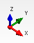
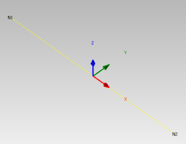
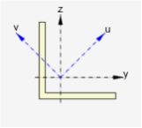
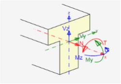

# Coordinate systems and convention of internal forces
All coordinate systems used are right-handed.

## Global coordinate system
X-axis of global coordinate system is horizontal and leads from left to right. 
Y-axis of global coordinate system is horizontal and leads backward. 
Z-axis of global coordinate system is vertical and leads upwards. 

## Local coordinate system of 1D member

Each 1D member is defined with begin and end node. Each 1D member has local coordinate system, which origin is in begin node of member. Local x axis of 1D member is identical with member axis and is oriented from being to end node of 1D member. Local Y axis of member is horizontal in general and local z axis leads upwards.

## Coordinate system of cross-sections

Cross-section has reference axes y (horizontal) and z (vertical).
Principal axes of cross-section are marked with u and v.
If reference axes are identical with main central axes of cross-section, only reference axes are drawn.

## Convention of internal forces on 1D members

Internal forces on 1D members perform following actions:
* positive bending moment My causes tension in cross-section fibers with negative z-coordinate. 
* positive bending moment Mz causes tension in fibers with negative y-coordinate 
* positive torsional moment Mx acts about x-axis of 1D member 
* positive axial force N acts in direction of x-axis of member and causes tension in cross-section fibers. 
* positive shear force Vz acts in direction of z-axis of cross-section.
* positive shear force Vy acts in direction of y-axis of cross-section. 

