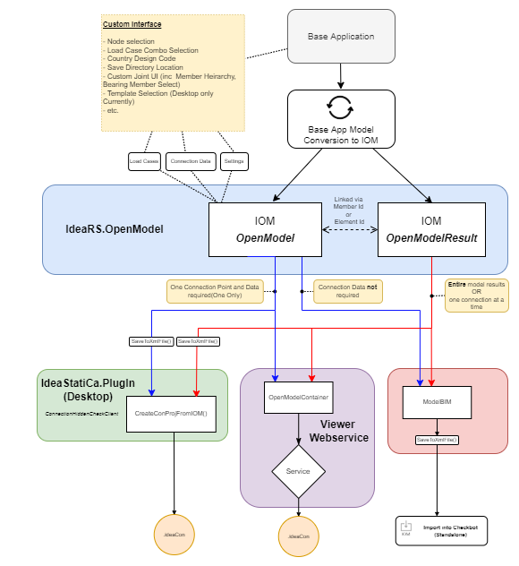

A simple app is defined by creating a 'one-time' IOM export or conversion from a third-party application or file format.

**Examples of Simple Apps:**
1. Create an IDEA connection file (.ideaCon) file from a node selection in an FEA or BIM software.
2. Create an app to allow conversion of one file format into IOM Open Model format.
3. Export the entire file or partial file (including results) to an IOM ModelBIM file to import into Checkbot.

**Benefits of simple apps:**
- Simple apps can be highly customized based on third-party user interfaces.
- Can be created using Windows form or Console Applications projects.
- Primarily rely on simple IOM OpenModel creation.
- Can use IDEAs cloud service to generate .ideaCon connection files.
- Integrate well with single connection optimization procedures and Template Applications.

**Limitations to simple apps:**
* Conversion of project materials and properties needs to be defined within the app and is not persistent. 
* No framework for syncing and updating once a connection has been created. If the model is updated the connection will need to be regenerated.

## Anatomy of a Simple App

The below provides a reference for the information contained below on the anatomy of options for simple app creation.



# Simple App Creation

## IDEA StatiCa Connection File from Third-party App. 

Probably the most widely used case for a Simple App is to export a single IDEA Connection file from a third-party application.

### 1. Define the Project Type, UI, and Features

It is up to the developer to define what features they want to include in the export. There is a list of case studies below that give insight into available options.

### 2. Create/Convert to IOM Open Model

The primary exercise is to convert the base application geometry schema to an IOM Model, which can be read by IDEA StatiCa Connection. 

The [Steel Frame Example](../../../examples/iom/IOM/readme.md) walks step-by-step through the primary class and generation of an IOM Model for a Steel Structure. 

#### Notes on the Steel Frame Example
* In the Steel Frame Example only **one** `ConnectionPoint` is defined within the Open Model output. IDEA StatiCa connection only allows for one connection to be imported through IOM (although the program itself does allow multiple connections). This is worth noting when trying to create multiple IDEA StatiCa connection files using this method. A separate IOM `.xml` file will need to be created with all relevant data. 

The [IOM Wiki page](../iom/iom_getting_started.md) provides some further in-depth documentation on more complex aspects of generating an IOM model. 

### 3. Extract the IOM Open Model Results (For FEA Apps)

For IOM coming from an FEA application, it is important that an IOM OpenModelResult `.xml/.xmlR` is created. This file provides all the result data required to provide load effects on the connection. 

Again, [Steel Frame Example](../../../examples/iom/IOM/readme.md) provides a brief explanation on how this is generated. 

#### Notes on the Steel Frame Example
* In contrary to the above, you can reference one single result file for the creation of all connection IOM exports. Result Forces for members not in the connection file will be ignored.
* The Steel Frame Example provides definitions of load groups, load cases, and load combinations. In practice, if the load combined effects for a load combination can be directly provided you can simply provide these results as a load case. 

The IOM Wiki pages below provide some further in-depth documentation on helping to generate IOM Result Files:
* [IOM Coordinate System](../iom/iom_coordinate_systems.md)
* [IOM Member Force Result Data](../iom/iom_open_model_result.md)
* [IOM Load Groups, Cases, Combinations](../iom/iom_loading.md)

### 4. Create the IDEA StatiCa Connection file

Once the IOM OpenModel and IOM OpenResult have been generated using one of the following options to create the `.IdeaCon` connection file: 

#### IDEA StatiCa Connection File using PlugIn (API)

```csharp
string iomFileName = "example.xml";

//If no results then set this string to String.Empty
string iomResFileName = "example.xmlR";

//Getting Desktop for this Example
var desktopDir = Environment.GetFolderPath(Environment.SpecialFolder.DesktopDirectory);
var fileConnFileNameFromLocal = Path.Combine(desktopDir, "connectionFromIOM-local.ideaCon");

//Using IdeaStatiCa.Plugin Package
var calcFactory = new ConnHiddenClientFactory(IdeaInstallDir);
var client = calcFactory.Create();

try
{
     //Creates connection project from IOM. This does not leave the connection open.
     client.CreateConProjFromIOM(iomFileName, iomResFileName, fileConnFileNameFromLocal);
}
catch(Exception e)
{
    Console.WriteLine("Error '{0}'", e.Message);
}
finally
{
    if (client != null)
    {
	client.Close();
    }
}		

```

#### IDEA StatiCa Connection File using Online Service

It allows to generate idea connection project without having Idea StatiCa on your PC. IOM and IOM results are sent to webservice which generates and returns Idea Connection project.

```csharp
public static void CreateOnServer(OpenModel model, OpenModelResult openModelResult, string path)
{
    IdeaRS.OpenModel.OpenModelContainer openModelContainer = new OpenModelContainer()
    {
	OpenModel = model,
	OpenModelResult = openModelResult,
    };

    // serialize IOM to XML
    var stringwriter = new System.IO.StringWriter();
    var serializer = new XmlSerializer(typeof(OpenModelContainer));
    serializer.Serialize(stringwriter, openModelContainer);

    string viewerURL = "https://viewer.ideastatica.com";
    var serviceUrl = viewerURL + "/ConnectionViewer/CreateFromIOM";

    Console.WriteLine("Posting iom in xml to the service {0}", serviceUrl);
    var resultMessage = Helpers.PostXMLData(serviceUrl, stringwriter.ToString());

    ResponseMessage responseMessage = JsonConvert.DeserializeObject<ResponseMessage>(resultMessage);
    Console.WriteLine("Service response is : '{0}'", responseMessage.status);
    if (responseMessage.status == "OK")
    {
	byte[] dataBuffer = Convert.FromBase64String(responseMessage.fileContent);
	Console.WriteLine("Writing {0} bytes to file '{1}'", dataBuffer.Length, path);
	if (dataBuffer.Length > 0)
	{
	    using (FileStream fileStream = new FileStream(path
             , FileMode.Create
	     , FileAccess.Write))
	    {
		fileStream.Write(dataBuffer, 0, dataBuffer.Length);
	    }
	}
	else
	{
	    Console.WriteLine("The service returned no data");
	}
    }
}

```

#### Launching IDEA StatiCa from your App.

Once the .ideaCon file has been created, you can choose to launch the IDEA StatiCa App directly from your application for editing and saving the user from having to open IDEA StatiCa and locate the file.

The steps to enable this interaction are explained [here](https://github.com/idea-statica/ideastatica-public/blob/main/docs/connection-app-automation.md).

**Note:** This primarily only works for apps creating one connection file.

## Allow Simple Checkbot Import through ModelBIM.

If you are wanting to use Checkbot for its advanced connection and member management features you can create an `XML` export of the  `IdeaStatiCa.PlugIn.ModelBIM` class.

A user can then import that file to view connections and defined results. More benefits will also be seen as the Checkbot application improves.

In order to do this, multiple connections should be defined in the IOM Data and then specified in the ModelBIM. Below shows how this can be done. 

```csharp

//connections: A list of Connection Ids that .IdeaCon files should be generated when file imported.
//members: A list of Member Ids that .IdeaMember files should be generated when file imported.

public static ModelBIM generateIOMModelBIM(OpenModel model, OpenModelResult results, List<int> connections, List<int> members)
{
    ModelBIM modelBIM = new ModelBIM();
    modelBIM.Results = results;
    modelBIM.Model = model;

    //Connection Items
    List<BIMItemId> items = new List<BIMItemId>();
    
    foreach (int ConnectionId in connections)
	items.Add(new BIMItemId() { Id = ConnectionId, Type = BIMItemType.Node });

    //Member Items
    List<BIMItemId> memberItems = new List<BIMItemId>();

    foreach (int memberId in members)
	items.Add(new BIMItemId() { Id = memberId, Type = BIMItemType.Member });


    modelBIM.Items = items;
    modelBIM.Messages = new IdeaRS.OpenModel.Message.OpenMessages();

    return modelBIM;
}

```
the ModelBIM can then be serialized to an `.XML` file which can be imported into Checkbot. 

```csharp

public static void SaveModelBIM(ModelBIM modelBim, string filePath)
{

    XmlSerializer xs = new XmlSerializer(typeof(ModelBIM));
    
    using(Stream fs = new FileStream(xmlFileName, FileMode.Create))
    {
        using(XmlTextWriter writer = new XmlTextWriter(fs, Encoding.Unicode))
        {
            writer.Formatting = Formatting.Indented;
            
            // Serialize using the XmlTextWriter.
            xs.Serialize(writer, modelBIM);
        }
    }
}

```