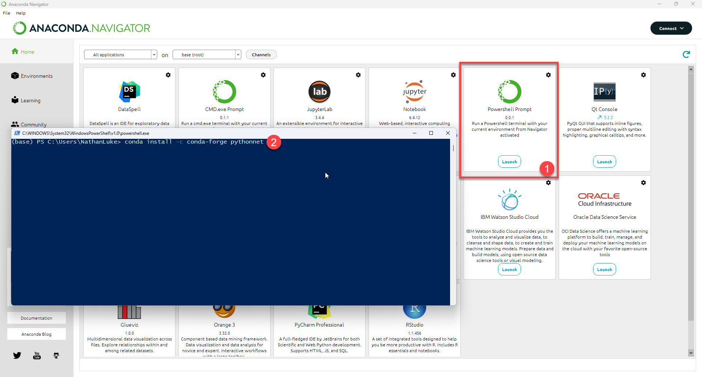
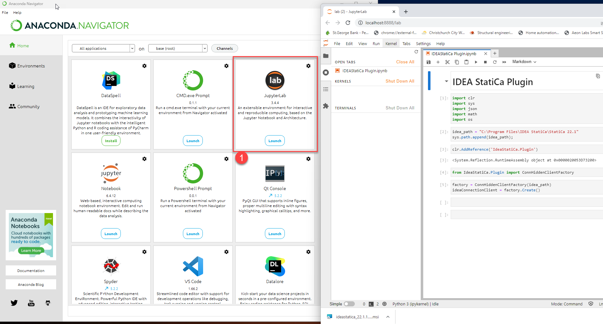

The below provides instructions on how to install Python and JupyterLab/Notebook using Anaconda.

## Step 1: Install Anaconda 

Anaconda automatically installs Python and most of the packages used in python programming.
1. Go to the [Anaconda website](https://www.anaconda.com/products/distribution) and install Anaconda 
2. Follow all the recommended installation options.

## Step 2: Install python .NET on Anaconda Environment

As the IDEA IOM and API are provided as .NET modules we will need to install python .Net within our python environment.

1. Open Anaconda Navigator Application and then open the anaconda shell. Copy and paste the below to Add.

```
conda install -c conda-forge pythonnet
```

1. ENURE that python .Net Version 3 or greater is installed.
2. Wait for confirmation python .Net has been installed and then close the Powershell window.
 
 
## Step 3: Launch JupyterLab from Anaconda Navigator and Test IdeaStatiCa.PlugIn

We can now open JupyterLab directly from the Anaconda Navigator



1. Start a new notebook and use the following code to test

```python

import clr
import sys
import json
import math
import os

idea_path = "C:\Program Files\IDEA StatiCa\StatiCa 22.1"
sys.path.append(idea_path);

clr.AddReference('IdeaStatiCa.Plugin')
from IdeaStatiCa.Plugin import ConnHiddenClientFactory

factory = ConnHiddenClientFactory(idea_path)
client = factory.Create()

client.OpenProject('MyConnectionProject.ideaCon')

## Do Something with the Opened Project.

client.CloseProject()
client.Close()

```
> If an error occurs, try to restart the kernel and re-run from top to bottom.
 
