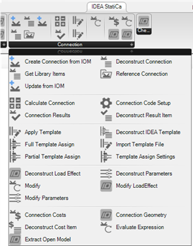

# IDEA Connection App Components

Here we will briefly describe components available to work with IDEA StatiCa Connection files in Grasshopper.

## The Connection Object

Most components relating to the IDEA Connection App allow the passing around of a ‘Connection’ object. 

**The connection object is a reference to an IDEA Connection file saved on disc.** First, a user will be required to either reference an existing connection that has previously been create or create one from scratch using the Open Model components.

In Grasshopper each ‘Connection’ object is treated as a single connection object. IDEA Connection project files that have multiple connections in the project are separated in Grasshopper and treated as multiple objects with a referenced file path and name. 

> [!WARNING]
> It is encouraged to work with IDEA StatiCa Connection Project files with a single connection.

The connection object can also store and manage a duplication of the available information that is extracted from the program. This should be persistent until the connection is modified – which reduces the calls required to the API.

## Connection Object Components

Below is a list of Components which are available to work with the Connection Object. 

Because users will likely need to work with large amounts of connections at once, components have been added with multiple ways of completing a task which allows us to batch update a single connection at a time rather than by multiple parallel operation. Therefore, there are typically multiple ways to do certain types of tasks. 

To increase performance, it is encouraged to load as much information when referencing the connection and trying to compile as many modifications into one step as possible if performing modifications. 

**Component** | **Description**
---------|----------
 **Reference Connection** | Reference an existing connection on disc to perform automated operations. When referencing the connection, you can opt to pre-load some of the connection information. This will open the connection and then extract the basic information about the connection. It will likely save you time downstream if you are not performing a lot of modification on the connection object.
 **Create from IOM** | Create an IDEA Connection File from the IOM Format. A user can either input a file path to an existing model XML file or directly wire the OpenModel object created from the IOM component library.  
 **Update from IOM** | This allows a user to update an existing connection file with a modified IDEA Open Model file. This would typically work in-conjunction with the Extract IOM Container component.
 **Deconstruct** | The deconstruct component can be used to get general information about the connection object, such as the connection name, file path, and settings etc.
 **Calculate Connection** | Perform calculation of the connection. Results are read and saved into the Connection Object. If the connection is Modified down the line, results will be wiped from the object. To view the results, pass the connection to the Connection Results Component. **The Connection is automatically saved after the calculation has been run.**
 **Connection Results** | Once a connection has been calculated results are stored on the connection object and can be retrieved using the Connection Results component. Results can be filtered by specific keys for different elements.
 **Modify Connection** | Allow you to make changes to connection items. Refer below for further information.
 **Apply Template** | Apply a template to a connection using the available template settings. Refer the section on Templates below.
 **Get Connection Geometry** | Retrieve the geometry of the connection into Grasshopper. This exports the connection and converts to Open Model objects. The Members and Connection Data are exported separately. **This component is useful for linking directly with CAD software.**
 **Get Connection Costs** | Allows the user to extract detailed fabrication costs of the connection. Each Cost item can be deconstructed into granular cost items using the Deconstruct Cost item component. 
 **Evaluate Expression** | Evaluate Expression allows you to evaluate expressions. Expressions are typically used in the Parameters interface, however, can also be used directly inside the application. The parameter reference guide provides examples of available parameters. Refer to the [Expression Parameters Reference Guide](../../api/api_parameter_reference_guide.md)

## Modifying a Connection

Connection modifications are things which will change the ‘design’ of the connection. 

To reduce the API connection time, we provide a modify connection component which can compile any number of defined modifications and apply them as required in a chronological order. We may separate modification operations in the future when quicker direct linking is possible. 

The Calculate component also has a modification input to allow performing of modifications prior to calculating. 

Connection modifications are collated and performed in a Hierarchical order:
1.	Update of Library Items*
2.	Update of Connection Settings
3.	Update of Connection Member Geometry*
4.	Update of Connection Operations – By Template (Full)
5.	Update of Connection Operations – By Template (Partial)
6.	Update of Connection Loading
7.	Update of Connection Parameters

*Update of these items are not currently possible.

> [!NOTE]
> Currently operations can only be updated through parameters. No direct access to operations exists.

### Saving vs Save As

Any component which performs a modification on the connection file provides the option to either save the connection or save as the connection. To help the user with this process they only need to provide a ‘Save As Suffix’ which will automatically be appended to the existing file in its location. If no suffix is provided the connection will simply be saved with the modification applied. 

> [!WARNING]
> Be careful if you are using a folder to reference all files with a .ideaCon file extension as this can relate in circular referencing if  adding additional files to this folder.

