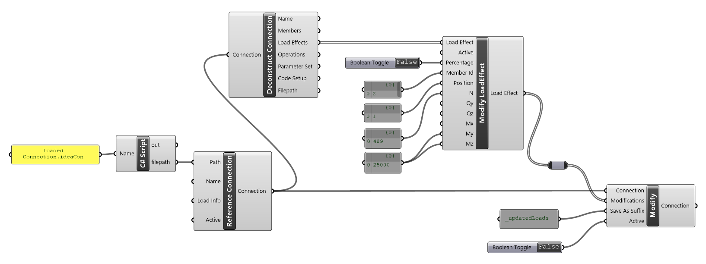
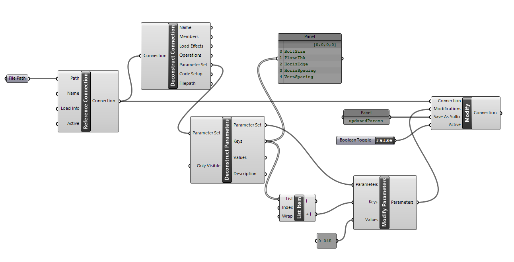

# Connection Item Components

Connections items are things in which we may want to extract and then also update in the connection using the _Modify Connection_ component. Item components relate to:

* Load Effects 
* Parameters
* Members (Not currently avaliable)
* Operations (Not currently avaliable)

**Component** | **Description**
---------|----------
 Deconstruct Item | This will deconstruct the item into its properties
 Modify Item | Change properties for an existing item. 

> [!NOTE]
> Currently it is not possible to create new or delete existing entities in a connection project.

In line with Grasshopper terminology, when a connection item in 'modified' a complete copy of that item is created and then the modifications undertaken. 

> [!NOTE]
> Modifications to the connection are not completed until the modified item is passed to the _Modifications_ input. The modification input automatically sorts and collates required modifications. 

## Modifying Load Effects

Load Effects can be updated in the connection by selecting a Load Effect from the list output from the Deconstruct Connection component.
 
The Modify Load Effect component uses flat list notion for updating. That means all inputs from Member Id and down need to have the same number of items. First the row is found by providing the Member Id and Position and then each of the provided values is updated. **If no value is provided for a row that value is unchanged in the provided load effect.**

You can change the load effect from an explicit force load effect to a percentage Load effect. When changing, all inputs should be input in as a percentage.  You can see the affect of the Percentage input parameter by again deconstructed the updated load Effect.

 
## Modify Connection Parameters

Using parameters in connection files is one of the most powerful ways to control existing connections and perform optimization procedures.  

Parameters can be extracted from a connection file using the Deconstruct Connection component. Parameters are extracted as a List of Parameter Sets. Currently a connection will only have one parameter sets and it holds all parameters available in the connection. You can modify parameters in the Parameter set using a Key and Value approach. 

When deconstructing parameters, you can select whether you want to extract only ‘Visible’ parameters or all the connection parameters.

For information on Parameters please refer to the [Using Parameters Guide](../../api/api_parameters_getting_started.md). 