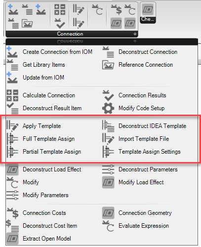

# Connection Template Components

Connection templates are files which store complex operation data that can be passed between connections of similar topology. Templates also store any defined connection parameters and other information about the base connection, such as member geometry and sections type. In grasshopper we provide some components which allow the application and deconstruction of IDEA StatiCa template files. 

## Connection Template Object

In grasshopper you can reference any number of previously defined templates. Currently only templates saved to disk (as ‘.ideatemp’) are importable in Grasshopper. 

When a template is imported, we can extract the available parameters that are stored in it. This allows us to understand what parameters will be available in the connection file once the template has been assigned. 

> [!NOTE]
> Templates can be exported from base connections using the developer mode in IDEA StatiCa connection.

## Connection Template Components

Below are the components which relate to Connection Templates.

**Component** | **Description** 
---------|----------
 **Import Template** | References an existing ‘.ideatemp’ connection template file which is saved on disc.  
 **Deconstruct Template** | Deconstruct template allows us to deconstruct information that is stored in the template file. Here, it is mainly used to extract the list of parameters that is stored in the template.  
 **Full Template Assign** | Defined a connection template assignment for a template that will be applied to all members in the connection. Here we can provide the template, associated template settings and any modifications to the parameters we would like to apply to the connection once the template has been applied.
  **Partial Template Assign** | Defined a connection template assignment for a template that will be applied two or more members in the connection. The supporting member plus a list of connection elements.
  **Template Settings** | Template settings allow for default connection settings to be specified with a template assignment. 

## Assigning a Template 

The apply template component can be used to assign one or more templates to a connection. 

Only one full connection template assign should be applied at a time, whereas multiple partials can be applied in succession. Full templates always get set before partial templates. 

Using template assignments allows us to provide multiple template applications at once using different assign settings. 

> [!NOTE] 
> To save time, a Template object can also be directly wired into a Template Assign input. When this is done, a **full template assign** is generated with default settings. 