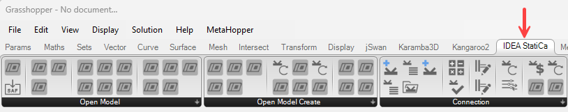

# Getting Started 

## Program Requirements

The plugin is currently developed for Rhino 7. Grasshopper is free and inbuilt into Rhino 7 so there is no need to install grasshopper separately. 

You can get a trial version of Rhino3d and Grasshopper from the [Rhino3d](https://www.rhino3d.com/download/) website.

## Plugin Installation

The Plugin can be installed through the [Rhino Package Manager](https://www.rhino3d.com/features/package-manager/).

Once installed and Rhino is restarted, the IDEA StatiCa tab will be available in Grasshopper.

## Plugin Requirements

The IDEA StatiCa is built as an extension to the latest versions of IDEA Open Model (IOM) and IDEA API modules. It is recommended when using these tools that the latest version of IDEA StatiCa is installed to work correctly and utilize all the latest features.

## Limitations 

> [!WARNING]
> Currently for the plugin to work properly, the Rhino Units should be set to **meters**. 

> [!WARNING]
> All Input Units should also be specified in **basic SI units**, which follows the IDEA Open Model designation. See [Open Model Units](../../iom/iom_units.md) specification for more details. 

## Help and Feedback

These tools are enhanced with close collabroation with advances users and their required workflows. We are very keen to hear any feedback or suggestions to improve the functionality available. 

Feedback is best provided through the forum on the IDEA StatiCa public GitHub. 

