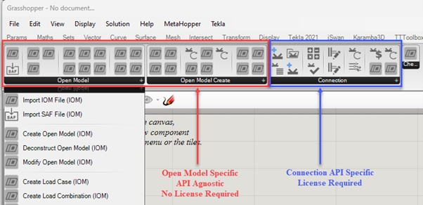

# Introduction

The IDEA StatiCa Grasshopper plugin consists of the following primary parts: 

1. [Components to generate IDEA Open Model (IOM)](grasshopper_iom_components_overview.md). These are used to facilitate:

    * Create, Import or Modify IDEA Open Model.
    * Custom FEA Conversions
    * Geometric conversion: IOM <-> Rhino
    * Explicit modelling of members, plates, bolts, cuts, and welds.

2.	[Components to interact with IDEA Design Applications](grasshopper_connection_app_components.md). The are used to:

    * Create, import, modify design app files, such as connections.
    * Get and update geometry and components.
    * Apply user defined templates.
    * Get and update user defined parameters.
    * Run calculation and extract results.
    * Get further design information (inc. fabrication costs etc.)

Components to generate IOM are API agnostic, and therefore do not require a license of IDEA StatiCa.  

Component that interacts with IDEA StatiCa Design App’s require an active license of IDEA StatiCa. 
Open Model components are used across Design App components in cases where geometry conversion and interoperability are concerned. 