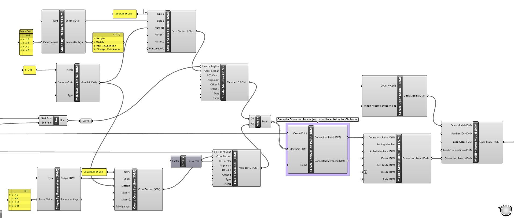
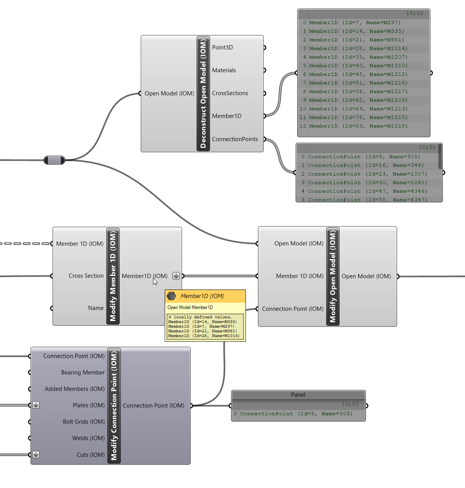

# Model Components

A Model is a compilation of all the single objects that form an entire model with appropriate relative references. An object created by one of the object components is a floating single entity until they are added/assigned to a compiled model. In most instances this relates to an Open Model.

Sometimes this will be related to a Compiled Object, however this term is interchangeable between Model or Model Result or any other of the compiled object which are described below. 

> [!IMPORTANT] 
> Objects need to be assigned to a compiled object before they can be transferred to and from IDEA StatiCa applications.

> [!NOTE]
> **Any number** of compiled objects can be on the canvas at any one time, making it an extremely flexible way of managing different models and results at the same time. 

## Model Object Components

There are five sub-types of components that relate to Open Model component: These are **Import**, **Convert**, **Create**, **Deconstruct**, **Modify**, **Save**, and **Inspect**.

Most of these components also relate to other types of compiled object types such as Open Model Result.

**Component Type** | **Description** 
------------|----------
 **Import (XML)** | This allows you to import an existing saved XML file format of a Compiled Object. You can import the XML definition for several different OpenModel formats. Such as OpenModel, OpenModelResult, OpenModelContainer and ModelBIM.
 **Convert** | Convert allow direct conversion of some other CAD or FEA formats to IOM directly inside of Grasshopper.
 **Create** | Create a new OpenModel with your desired settings.
 **Deconstruct** | Break down a model to see all the assigned objects within it.  For a model this is useful to inspect the Members, Materials, Cross-sections within it.
 **Modify** | Modify a Created or Imported OpenModel. This is the primary component used to add or update objects in a created OpenModel. This is explained in further detail below.  
 **Save** | Save XML allows you to save OpenModel, OpenModelResult, and ModelBIM format to an XML file on disk. 
 **Inspect** | Open Models can also be inspected for the entire XML output of the constructed model.

## Model Compilation

Each time the Model Modify component is run the model is re-compiled. When an object is assigned to a model, a duplicate of the original object is created and assigned to the model database. **If the Id and Name of a particular object are not set previously then they are set as required to the copied object.**

**Model compilation is done in a recursive manner**, meaning, objects which are required by others are automatically added to the model if they are not already available. For example, if a member is referenced in a connection point, then that member is automatically added to the model, along with the required cross-section and material if it is not already apparent in the model. The image below shows this in practice: 

Here only the connection point has been provided to the Modify Model component. A validation occurs and automatically adds the required Members along with the cross-sections and relavant materials. 

Furthermore, if a material is already defined in a Model, then a reference to that object is created. Whenever a model is recompiled, references between different objects are automatically created and the model revalidated.

> [!WARNING]
> Using this system allows us to reduce the number of required inputs in the _Modify Model_ component. However, it can cause some issues if not careful.It is very important to keep **Object Names Unique** if they represent different objects.

> [!NOTE] 
> Objects which are typically added in a recursive manner generally have required Name inputs - such as Materials,  Cross-sections which helps reduce user errors.

## Modifying a Model

The modify component follows typical Grasshopper logic, by first creating a duplicate of the input Model and then updating the duplicate with the provided modifications.

Each modify component has inputs for the objects which can be explicity added or updated in the provided model. The input first checks whether the provided object exists in the model **(by its Name)** and if so, is replaced with the updated object provided. If the object is not present in the model, it is added to the model. 

The image below demonstrates updating a set of Members and a Connection Point which is already defined in an existing Model. 

In this instance there is already a list of Members and Connection Points assigned in the Model. Here we want to update the cross-sections of 4 of the existing Members so we provide the Modified Members to the explicit Add/Update input in the Modify Open Model component. The same goes for the Modify Connection Point, where we add additional Plate and Cut information to the existing Connection Point.

The same goes for objects assigned to Connection Points (as it is also a compiled object), if an object is already assigned in a connection point, then it will be updated, else it will be added to the connection point. In general, we will likely only want to add things to a connection point. 

> [!NOTE]
> Currently objects cannot be deleted from a model