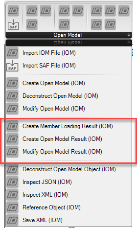
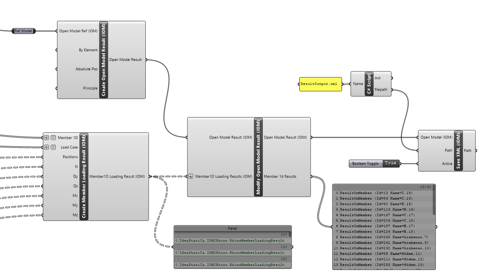
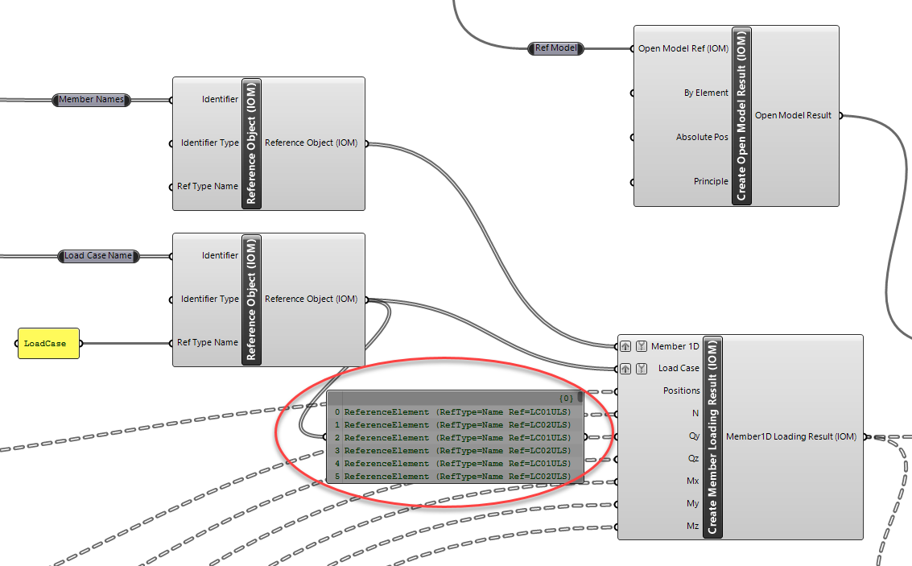

# Open Model Result Components

Open Model Results are used for the storing of analysis results for related analytical members. Using Grasshopper, results in the Open Model Result format can easily be created using the avaliable components. This allows a very flexible way of linking Physical model with analytical FEA model results.

> [!NOTE]
> Refer to documenation on the Open Model Result for internal force designations and explanations on how to create correct Open Model Result files.

## Creating Open Model Result 

Creating Open Model Results works in a similar way to other compiled object types. First, the high level object should be created with desired settings, then it can be modified by adding or updating existing entities.

The _Create Member Loading Result_ Component can be used to create loading results for a specific member and load case. The Member and Load Case inputs are item inputs which relate to a list of position and internal force results. Typically a mimnimum of two position (begin and end) and force values are to be provided for each member loading result. 

The output of this component is a list of results were each relates to a member and a result for a particular load case. It has been set up this way to reduce complexitiy in creating results. 

When the list of these results in passed to the _Modify Open Result_ component these are compiled into combined Memmber 1D results, which are Member results storing all the combined load case data. 

> [!NOTE]
> Open Model Results can be saved by using the Save XML component.

## Using a Reference Model

Currently the Open Model Result uses Id values to reference between Members in the Open Model and Open Member results. 

By providing an optional reference model we can extend this functionality by enabling referencing by further options - such as Name or direct object input.  

## Member and Load Case References

When creating Member Loading Results we can take advantage of the _Reference Element_ Component to choose how we want to find related references that are within the Open Model. In the image below the result data references the member and load case by name. 

We can then set the identifier type to 'Name', which will ensure that the model is searched for a member and load case of that name and ensure the correct referencing.

