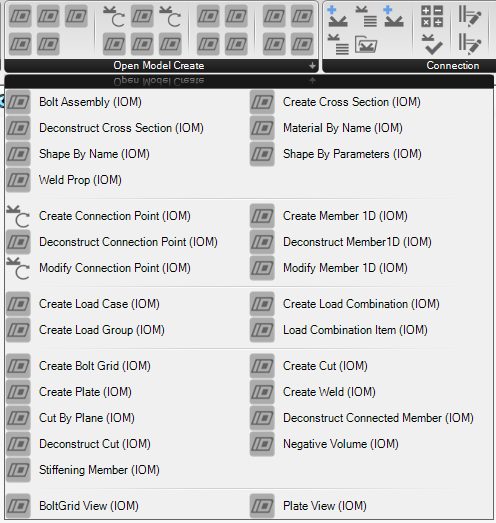
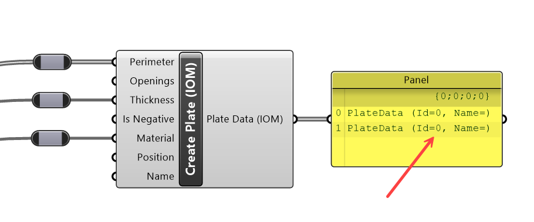

# Open Model Object Components

Object components relate to a specific object type in the Open Model data format. Basically, any object which is required to have an Id or Name can be classified as an Open Model Object.

## Open Model Object Component Types

There are five sub-types of components that relate to Open Model objects, these are: **Create**, **Deconstruct**, **Modify**, **View**, **Inspect**.

**Component Type** | **Description** 
------------|----------
 **Create** | Creates a new Open Model object of the prescribed type
 **Deconstruct** | Break down an object into its components and references and provides information about the Object. This typically is useful for imported objects.
 **Modify** | Modifies a previously created object. Modify components allow certain object properties to be updated. The modify object creates a copy of the object with changed properties. 
  **View** | Provides some different view representations of the object. This only relates to geometric entities. For example the Plate view component can provide this outline, the surface or the volume of the plate. 
 **Inspect** | IOM Objects can be serialised into XML, and to a lesser extent JSON. The Inspect components allows the User to get the XML string representation of any IDEA IOM Object.

## Object Creation

All Open Model Objects are required to have an Id and Name. To make object creation quicker, and to improve usability most objects do not require a user defined id or name on creation, and can be left to be assigned automatically when they are added and compiled to a model. 

> [!NOTE] 
> Objects that do not have an Id or Name assigned automatically get assigned an **Id = 0** and an **Empty Name** string. 

When using a Create component the output should show the Name and Id provided to that object. The output string is the Open Model Object Type.

> [!IMPORTANT]
> When creating objects in Grasshopper the object **Name should be a Unique** string for a particular object type.

> [!NOTE]
> Some specific objects like materials, cross-sections, load cases and combinations do **require a name** on object creation. 