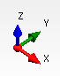
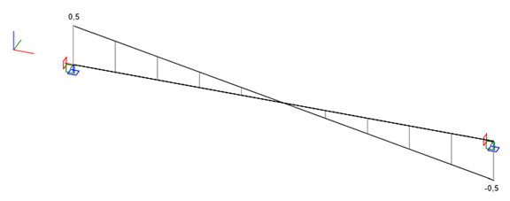
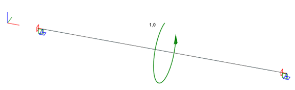

As a general rule, you can consider all coordinate systems used are right-handed. 

# Global Coordinate System



All elements and nodes are defined in a standard cartesian axis system with the **z-axis** vertical:

* The X-axis of the global coordinate system is horizontal and reads from left to right. 
* The Y-axis is horizontal and reads from bottom to top. 
* The Z-axis of the global coordinate system is vertical and leads upwards.

# Local Coordinate Systems

## 1D Members


Each `1D member` is defined by a start and end node and has a local coordinate system defined in the following way:
* Origin is defined as the start node of the member. 
* The local x-axis follows the member axis, oriented from the start to the end node.
* The local y-axis of the member is horizontal in general.
* The local z-axis leads upwards and is the normal of the 1D member.

### Define 1D member coordinate systems
It is important to pay attention to the correct setting of coordinate systems of 1D members. This is especially the case when converting from FEA models applications as it can cause unbalanced internal forces in exported connections.

The coordinate system of a member is a property of `Segment3D`.

There are 3 options how to define the `Segment3D` coordinate system within the 1D Member:

#### CoordSystemByPoint
* [CoordSystemByPoint](https://github.com/idea-statica/iom/blob/master/IdeaRS.OpenModel/Geometry/Geometry3D/CoordSystemByPoint.cs) 

Defining a coordinate system by point allows you to define a reference point in the model to orient the local coordinate system of the member. You can specify which member plane will be the plane that will be aligned with the selected point. You typically may want to either use `Plane.ZX` or `Plane.YX`. Using `Plane.ZX` will rotate the Coordinate system around the member x-axis so that the member normal (z-axis) is in the direction of the specified point.

```csharp
LineSegment3D segment3D = new LineSegment3D();

segment3D.StartPoint = new ReferenceElement(model.Point3D.FirstOrDefault(item => item.Name == startNode));

CoordSystemByPoint system = new CoordSystemByPoint();
system.Point = new Point3D() { X = 100000, Y = 0, Z = 0 };
system.InPlane = Plane.ZX;
segment3D.LocalCoordinateSystem = system;
```
This is typically used for vertical elements. 

#### CoordSystemByvector
* [CoordSystemByVector](https://github.com/idea-statica/iom/blob/master/IdeaRS.OpenModel/Geometry/Geometry3D/CoordSystemByVector.cs)

#### CoordSystemByZup
* [CoordSystemByZup](https://github.com/idea-statica/iom/blob/master/IdeaRS.OpenModel/Geometry/Geometry3D/CoordSystemByZup.cs)

The coordinate system by Z up aligns the member local z-axis (as close as possible) to the global Z-axis up direction:
* This is the default option for non-vertical members. 
* For vertical members x-axis (member axis) is vertical then the y-axis local follows the global Y-axis.

### 1D Member Eccentricities

Eccentricities (or offsets) specify a local vector translation from the `Element1D` start and end nodes.

Eccentricities are specified in the local coordinate system through the respective 'Element1D' properties.

### 1D Member Rotations

Rotations of the Cross-section around the LCS are completed through the `Element1D` `RotationRx` property. 

Rotations follow a right-hand rule system around the member local x-axis direction.

## Coordinate system of cross-section


Cross-sections have reference axes y (horizontal) and z (vertical). Principal axes of the cross-section are marked with u and v. 

If reference axes are identical with the main central axes of cross-section, only reference axes are drawn.

**By default, cross-sections are applied to Member 1Ds with the reference axis aligning with the coordinate system of the member.**

### Cross-section rotations

Cross-sections can be rotated prior to being applied to the local coordinate system of the member. Follow a right-hand rule system based on the x-axis being up (facing out-of-page) of the page local x-axis direction.

# Convention of internal forces on 1D members

Convention of internal forces in IDEA StatiCa structural model is summarized on the following six sets of examples.

## Normal force N
Positive (+N) normal force causes tension. Negative (-N) normal force causes compression.

**Axial load [X]**


**Resulting normal force [N] diagram**


**Effects of the normal force [N] on a beam element**


## Shear force Vy
Positive (+Vy) shear force shifts the left face in the positive Y axis direction.

**Continuous load [Y]**


**Resulting shear force [Vy] diagram**


**Effects of the shear force [Vy] on a beam element**


## Shear force Vz
Positive (+Vz) shear force shifts the left face in the positive Z axis direction.

**Continuous load [Z]**


**Resulting shear force [Vz] diagram**



**Effects of the shear force [Vz] on a beam element**


## Torsion Mx
Positive (+Mx) torsion twists the left face counterclockwise.

**Point load [Mx]**



**Resulting torsion [Mx] diagram**


**Effects of the torsion [Mx] on a beam element**


## Bending moment [My]
Positive (+My) bending moment causes tension the fibers with a negative Z coordinate.

**Continuous load [Z]**


**Resulting bending [My] diagram**


**Effects of the bending [My] on a beam element**


## Bending moment [Mz]
Positive (+Mz) bending moment causes tension the fibers with a negative Y coordinate.

**Continuous load [Y]**


**Resulting bending [Mz] diagram**


**Effects of the bending [Mz] on a beam element**


# Convention of load effects in the Connection app

The load effects input on the connected beams in the Connection app follow the LCS axes. As a beam can either be connected by its startpoint or endpoint, the load effects directions change accordingly.

## Visualization of the load effect convention in the Connection app

The positive (+) force components act in positive directions of LCS axes. Beam connected by endpoint (left) and startpoint (right):


The positive (+) moment components strictly follow the right-hand rule. Beam connected by endpoint (left) and startpoint (right):


## Conversion between the structural model results and Connection app load effects

As a result of both the conventions documented above, there is a transformation of internal force results to load effects taking place internally.

This transformation happens every time a connection project is created on the basis of a structural model.

`Internal force vector {N, Vy, Vz, Mx, My, Mz}`

Startpoint (relative position = 0)

`Tranformation to load effects {+1, -1, -1, +1, -1, +1}`

Endpoint (relative position = 1)

`Tranformation to load effects {-1, +1, +1, -1, +1, -1}`

Consider the example of two cantilevers below. One is supported in the standpoint (relative position 0), the other in the endpoint (relative position 1).


Internal forces in the fixed points of the cantilevers are `{1, 0, 1, 0, -1, 0}` and `{1, 0, -1, 0, -1, 0}`, respectively.

When connections are generated in these points, the transformation vector above is applied, with the following results.


Load effects in the fixed points of the cantilevers are `{1, 0, -1, 0, 1, 0}` and `{-1, 0, -1, 0, -1, 0}`, respectively.

Comparing the deformed shapes of the connections above, their behaviour confirms the correct transformation and is in accordance with the structural model.


