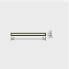
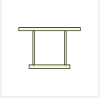
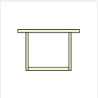
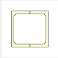
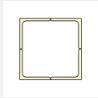
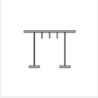

# Adding Cross-Section Properties to IOM Open Model  

This example demonstrates how to add section properties to an IOM model using the `IdeaRS.OpenModel.CrossSection.CrossSectionFactory` class. 

The `CrossSectionFactory` class provides a list of methods to populate a `CrossSectionParameter` with the correct parameters and section types available in IDEAStatiCa. 

Although most, not all cross-section definitions in IOM are defined using the `CrossSectionFactory`. Refer below for which cross-section types this applies. 

> ## Current Limitations
>* There is no method in the `CrossSectionFactory` which allows quick creation of a 'Standard' Section. I.E the manual creation of the 'UniqueValue' parameter needs to be specified.    
>
>* Note that IDEAStatiCa breaks standard sections into plates and therefore does not take into consideration a small radius in sections. Therefore any type of 'standard' section can be represented as a welded plate cross-section. 
>
>


This also includes sections that are to be referenced from the IDEAStatiCa Section library. Use the `'UniqueName'` parameter to reference.


# Library Shapes

Below indicates how should be used to generate sections as per the Rolled Sections tab in IDEAStatiCa Cross-Section Navigator.

```c#
using IdeaRS;
using IdeaRS.OpenModel.Material;
using IdeaRS.OpenModel.CrossSection;
using IdeaRS.OpenModel.Geometry2D;
---
public static void Example_AddLibraryCrossSection(OpenModel openModel)
{
    CrossSectionParameter cs = new CrossSectionParameter() { Id = 1, Name = "myLibrarySection" };
	
    MatSteel material = openModel.MatSteel.First();
	cs.Material = new ReferenceElement(material);

	cs.CrossSectionType = CrossSectionType.UniqueName;
    cs.Parameters.Add(new ParameterString() {Name = "UniqueName", Value = "HEB200"});

    openModel.AddObject(crossSectionParameter);
}
```

## Section Conversion

To convert a Libary shape in one application to a Libary shape in IDEAStatiCa, you can either:

1. Manage conversions through the Checkbot App. (Recommended)
2. Create your own conversion table sets within your conversion code.

The Checkbot App allows you to manage the shapes which were not able to be automatically converted into IDEAStatiCa. You can select an appropriate section for these non-converted shapes through the conversion options which are available after import. To ensure a section is created, provide a 'UniqueName' parameter to the cross-section (similar to the Library example above). On import, IDEAStatiCa will attempt to find the cross-section within the available Libraries. If not found it will be added to the conversion options list. 

## Managing _Not-Implemented_ Sections in IOM

If a shape is not available to be currently defined, a 'UniqueName' section can be generated in order to provide a placeholder for the section. On import, IDEAStatiCa will attempt to find the section within the available Libraries. The Checkbot conversion options can then be used to apply the correct section from within IDEA. 

# Parametric Shapes

Cross-sections that are generated from 'parameters' alone (not regions or lines) are of the `CrossSectionParameter` class. The `CrossSectionParameter` object is created and then passed to the CrossSectionFactory to be filled with all the required parameters of a particular shape.

The example below is for an I section shape cross-section can be generated as below:

```c#
public static void Example_CreateAndAddCrossSection(OpenModel model)
{	
	CrossSectionParameter crossSectionParameter = new CrossSectionParameter() { Id = 1, Name = "myISection" };
	MatSteel material = model.MatSteel.First();
	crossSectionParameter.Material = new ReferenceElement(material);

	CrossSectionFactory.FillCssIarc(crossSectionParameter, 0.25, .045, 0.02, 0.03, 0.012, 0, 0.015);

	model.AddObject(crossSectionParameter);
}
```

## Rolled Sections
Below indicates which `CrossSectionFactory` method should be used to generate sections as per the Rolled Sections tab in IDEAStatiCa Cross-Section Navigator.

> In the IDEAStatiCa connection, rolled cross-sections are broken up into separate plate elements for FEA calculation. Radi and tapers are neglected in this step, hence in many cases rolled sections can also be defined using the Welded/Composed methods.  

IDEA Shape Ref | Image |Factory Method  `CrossSectionFactory.` | Notes
---------|---------|----------|---------
 Circular |  | `FillCircle(...)` | 
 General Plate |  | `FillRectangle(…)` | 
 I |  | `FillCssIarc(…)` | For asymmetric I-sections the `FillWeldedAsymI(…)` can be used.
 Channel |  | `FillCssSteelChannel(…)` |
 Angle |  | `FillCssSteelAngle(…)` |
 General Tube |  | `.FillCHSPar(…)` / `FillSteelTube(…)` |
 T (I Cut) |  | `FillSteelTI(…)` | This requires the Name of an IDEAStatiCa Library I section.
 **Additional** |  |
  Square Hollow |  | `FillCssSteelRectangularHollow(…)`


## Welded, Composed Cross-Sections 
Below indicates which `CrossSectionFactory` method should be used to generate sections as per the Rolled Sections tab in IDEAStatiCa Cross-Section Navigator.

IDEA Shape Ref | Image | Factory Method  `CrossSectionFactory.` | Notes
---------|----------|--------- |---------
 2I |  |  _Not Implemented_ | 
 2Uo | |  `FillShapeDbLU(…)` | You need to specify section shapes manually for this method.
 2Uc |  | `FillWelded2Uc(…)` | This method requires the Name of an IDEAStatica Library Channel.
 2Lt |  | `FillWelded2Lt(…)` | This method requires the Name of an IDEAStatica Library Angle.
 2Lu | | `FillWelded2Lu(…)` | This method requires the Name of an IDEAStatica Library Angle
 Iw | | `FillWeldedI(…)` | 
 Iwn | | `FillWeldedAsymI(…)` | This item can be used to define a asymmetric ‘rolled’ I section.
 Tw | | `FillWeldedT(…)` | 
 Box FI |  | `FillBox2(…)` | 
 Box Web |  | _Not Implemented_ | Define this using the `CrossSectionComponent` class
 Box 2I |  | _Not Implemented_ | 
 Box 2U |  | `FillWelded2Uc(…)` | Set 'distance' parameter to zero.
 Box 2L |  | _Not Implemented_
 Box 4L |  | _Not Implemented_
 Box Delta |   | _Not Implemented_ | Define this using the `CrossSectionComponent` class
 Box Triangle |  | _Not Implemented_ | Define this using the `CrossSectionComponent` class
 General Steel | | Does not use `CrossSectionFactory` | Define this using the `CrossSectionComponent` class. An example is show below.


## Creating a General Welded Cross-Section

Creating a general steel cross-section, i.e one that is made up of a number of components. (i.e plates or other items) requires the use of the `CrossSectionComponent` class. This object can store a number of `CssComponent`'s.

>Note: You cannot currently add `CrossSectionParam` objects to a `CrossSectionComponent`. Each plate will need to be specified individually and has its own material and phase.

The example below creates a custom T-shape arrangement as shown below.


```C#
public static void Example_CreateComponentCrossSection(OpenModel openModel)
{	
	CrossSectionComponent componentCrossSection = new CrossSectionComponent() { Id = 1, Name = "myComponentCrossSection" };

	//Component 1
	CssComponent comp1 = new CssComponent() { Material = new ReferenceElement(openModel.MatSteel.First()), Phase = 0 };
	Region2D region = new Region2D();
	PolyLine2D outline = new PolyLine2D();

	outline.StartPoint = new Point2D() { X = 0, Y = 0 };
	outline.Segments.Add(new LineSegment2D() { EndPoint = new Point2D() { X = 0.2, Y = 0 } });
	outline.Segments.Add(new LineSegment2D() { EndPoint = new Point2D() { X = 0.2, Y = -0.015 } });
	outline.Segments.Add(new LineSegment2D() { EndPoint = new Point2D() { X = 0, Y = -0.015 } });
	outline.Segments.Add(new LineSegment2D() { EndPoint = new Point2D() { X = 0, Y = 0 } });

	region.Outline = outline;

	comp1.Geometry = region;
	componentCrossSection.Components.Add(comp1);

	//Component2
	CssComponent comp2 = new CssComponent() { Material = new ReferenceElement(openModel.MatSteel.First()), Phase = 0 };
	region = new Region2D();
	outline = new PolyLine2D();

	outline.StartPoint = new Point2D() { X = 0.095, Y = -0.015 };
	outline.Segments.Add(new LineSegment2D() { EndPoint = new Point2D() { X = 0.105, Y = -0.015 } });
	outline.Segments.Add(new LineSegment2D() { EndPoint = new Point2D() { X = 0.105, Y = -0.14 } });
	outline.Segments.Add(new LineSegment2D() { EndPoint = new Point2D() { X = 0.095, Y = -0.14 } });
	outline.Segments.Add(new LineSegment2D() { EndPoint = new Point2D() { X = 0.095, Y = -0.015 } });
	region.Outline = outline;

	comp2.Geometry = region;
	componentCrossSection.Components.Add(comp2);

	openModel.AddObject(componentCrossSection);
}

```
## Cold Formed CrossSections
Below indicates which `CrossSectionFactory` method should be used to generate sections as per the Cold-formed sections tab in IDEAStatiCa Cross-Section Navigator.

IDEA Shape Ref | Image | Factory Method  `CrossSectionFactory.` | Notes
 ------ | ------| ------ | ------
 CF Omega |  | `.FillColdFormedOmega(…)`	|
 CF C | | `.FillColdFormedC(…)`	|
 CF C+ | | _Not Implemented_	|
 CF L | | `.FillColdFormedL (…)` |	
 CF Lgen | | `.FillColdFormedLgen(…)` |	
 CF Z |  | `.FillColdFormedZ(…)` |
 CF Regular Polygon |  | `.FillColdFormedRegularPolygon(…)` |	
 CF Sigma |  | `.FillColdFormedSigma(…)`	|
 CF U |  | `.FillColdFormedChannel(…)` |	
 CF ZED |  | `.FillColdFormedZed(…)` |
 CF RHS |  | `.FillColdFormedRHS(…)` |
 General Tube |    | `.FillSteelTube(…)` |
 CF 2Co |  | _Not Implemented_	|
 CF 2C+o |  | _Not Implemented_	|
 CF General Shape |  | `.FillColdFormedGeneral(…)` |	The general cold-formed section is not a parametric section and therefore has its own class, `CrossSectionGeneralColdFormed` to store the polyline which defines its shape. Refer below for an example. 


The example below show how to generate a General cold-formed section. 
```C#
public static void Example_CreateAndAddColdFormedGeneralCrossSection(OpenModel openModel)
{
	CrossSectionGeneralColdFormed coldFormedSection = new CrossSectionGeneralColdFormed() { Id = 1, Name = "myColdFormedSection" };

	MatSteel material = openModel.MatSteel.First();
	coldFormedSection.Material = new ReferenceElement(material);

	Region2D region = new Region2D();
	PolyLine2D outline = new PolyLine2D();

	outline.StartPoint = new Point2D() { X = 0, Y = 0 };

	LineSegment2D seg = new LineSegment2D();
	seg.EndPoint = new Point2D() { X = 0.050, Y = 0.050 };
	outline.Segments.Add(seg);
	seg = new LineSegment2D();
	seg.EndPoint = new Point2D() { X = 0.1, Y = 0.050 };
	outline.Segments.Add(seg);
	seg = new LineSegment2D();
	seg.EndPoint = new Point2D() { X = 0.15, Y = 0.000 };
	outline.Segments.Add(seg);

	region.Outline = outline;

	double thickness = 0.003;
	double innerRadius = 0.005;

	CrossSectionFactory.FillColdFormedGeneral(coldFormedSection, region, thickness, innerRadius);

	openModel.AddObject(coldFormedSection);
}
```

## Timber Sections

Timber shapes are currently not implemented in IOM.

## Concrete Sections
Below indicates which `CrossSectionFactory` method should be used to generate concrete sections as per the IDEAStatiCa Cross-Section Navigator.

IDEA Shape Ref | Image | Factory Method  `CrossSectionFactory.` | Notes
 ------ | ------| ------ | ------
 Rectangular |  | `FillRectangle(…)`	|
 Circular | | `FillCircle(…)`	|
 I Shape | | `FillShapeI(…)`	|
 T Shape | | `FillShapeT(…)` |	
 T Shape Reverse | | `.FillShapeTrev(…)` |	
 L Shape |  | `FillShapeL(…)` |
 L Shape Mirror |  | *Not Implemented* |	
 S Shape |  | *Not Implemented*	|
 Z Shape |  | *Not Implemented* |	
 U Shape |  | `FillShapeU(…)` |
 U Shape Reverse |    | *Not Implemented* | Use `FillShapeU(...)` and flip the LCS
 Rectangular Hollow |  | `FillCssRectangleHollow(…)` |
 Circular Hollow |  | `FillOHollow(…)` |
 Oval Shape |  | *Not Implemented* |
 I Shape with Haunched Flanges |    | `FillShapeIBase(…)` |
 T Shape with Champfer |    | *Not Implemented* |
 T Shape with Haunched Wall and Chamfer |    | *Not Implemented* |
 Trapezoidal Shape |    | `FillShapeTrapezoid1(…)` |
 T Shape with Haunched Flanges |    | *Not Implemented* | Use `FillShapeTrev1(...)` and flip LCS.
 T Shape with Haunched Wall |    | `FillShapeTwh(…)` |
 Inverted T Shape with Haunched Flanges |    | `.FillShapeTrev1(…)` |
 Inverted T Shape with Haunched Wall |    | *Not Implemented* | Use `FillShapeTwh(…)` and flip LCS.
 Double T Shape |    | `.FillShapeTT(…)` |
 Double T Shape with Chamfers |    | *Not Implemented* |
 Hollow Cross Section 1 |    | *Not Implemented* | Use method for General Concrete Section
 Hollow Cross Section 2 |    | *Not Implemented* | Use method for General Concrete Section
 Asymetrical I Shaped |    | *Not Implemented* | Use method for General Concrete Section
 Slab on Trapezoidal Sheet |    | *Not Implemented* |
 Slab on Trapezoidal Sheet Negative |    | `.*Not Implemented* |
 General Concrete Section |  Does not use `CrossSectionFactory` | Define this using the `CrossSectionComponent` class. An example is shown below.

The example below shows how to generate a General concrete section with an opening.
```C#
public static void Example_CreateConcreteComponentCrossSection(OpenModel openModel)
{	
	//Concrete material
	MatConcreteEc2 mat = new MatConcreteEc2();
	//...
	openModel.AddObject(mat);

	//Cross-section without the bars
	//One component square 0.8x0.8m
	IdeaRS.OpenModel.CrossSection.CrossSectionComponent css = new IdeaRS.OpenModel.CrossSection.CrossSectionComponent();
	css.Name = "CSS1";

	//Component of cross-section
	CssComponent comp = new CssComponent();
	comp.Material = new ReferenceElement(mat);
	comp.Phase = 0;

	//Geometry of component 0.8x0.8
	Region2D region = new Region2D();
	PolyLine2D outline = new PolyLine2D();
	outline.StartPoint = new Point2D();
	outline.StartPoint.X = -0.04;
	outline.StartPoint.Y = -0.04;
	LineSegment2D seg = new LineSegment2D();
	seg.EndPoint = new Point2D();
	seg.EndPoint.X = 0.04;
	seg.EndPoint.Y = -0.04;
	outline.Segments.Add(seg);
	seg = new LineSegment2D();
	seg.EndPoint = new Point2D();
	seg.EndPoint.X = 0.04;
	seg.EndPoint.Y = 0.04;
	outline.Segments.Add(seg);
	seg = new LineSegment2D();
	seg.EndPoint = new Point2D();
	seg.EndPoint.X = -0.04;
	seg.EndPoint.Y = 0.04;
	outline.Segments.Add(seg);
	seg = new LineSegment2D();
	seg.EndPoint = new Point2D();
	seg.EndPoint.X = -0.04;
	seg.EndPoint.Y = -0.04;
	outline.Segments.Add(seg);
	region.Outline = outline;

	//Optional - setting openning in this component 0,2x0,2
	PolyLine2D openning = new PolyLine2D();
	openning.StartPoint = new Point2D();
	openning.StartPoint.X = -0.01;
	openning.StartPoint.Y = -0.01;
	seg = new LineSegment2D();
	seg.EndPoint = new Point2D();
	seg.EndPoint.X = -0.01;
	seg.EndPoint.Y = 0.01;
	openning.Segments.Add(seg);
	seg = new LineSegment2D();
	seg.EndPoint = new Point2D();
	seg.EndPoint.X = 0.01;
	seg.EndPoint.Y = 0.01;
	openning.Segments.Add(seg);
	seg = new LineSegment2D();
	seg.EndPoint = new Point2D();
	seg.EndPoint.X = 0.01;
	seg.EndPoint.Y = -0.01;
	openning.Segments.Add(seg);
	seg = new LineSegment2D();
	seg.EndPoint = new Point2D();
	seg.EndPoint.X = -0.01;
	seg.EndPoint.Y = -0.01;
	openning.Segments.Add(seg);
	region.Openings.Add(openning);

	comp.Geometry = region;
	css.Components.Add(comp);
	
	openModel.AddObject(css);
}

```


## Non-symetrical Cross-sections.

A simple explanation of the IOM Co-ordinate system can be found [here](iom_coordinate_systems.md). Here we will the preferred method of dealing with non-symmetrical section shapes.

**Asymmetrical** cross-sections are those with one axis of symmetry. (i.e I beam with different flange widths). These have **two** possible orientations.

**Unsymmetrical** cross-sections are those with no axis of symmetry. (i.e Angle section). These of which have **four** possible orientations. 

> Note: The below applies primarily to **Steel** cross-sections. Some **Concrete** sections do have `CrossSectionFactory` methods which can directly generate the inverted/reverse version without requiring resetting of the member LCS.  

Option A | Option B | Option C | Option D
---------|----------|--------- | ---------
 |  |  | 
 Base shape | Base shape _mirrored_ (using mirrored param in `CrossSectionFactory` method) | Base shape with **Local Co-ordinate system of Member reversed when setting** | Base shape _mirrored_ and **Local Co-ordinate system of Member reversed when setting**.
