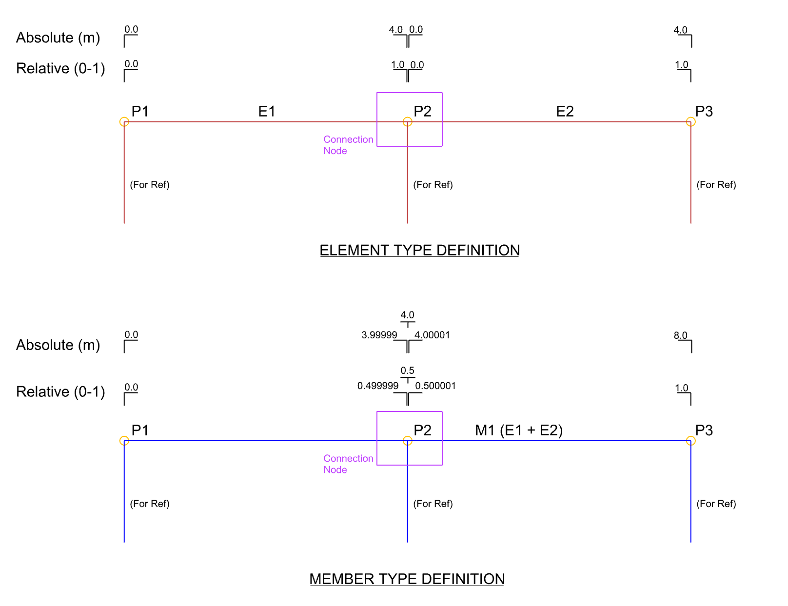

# IOM Open Model Result

The IOM `OpenModelResult` class provides a way of storing member force results from an FEA analysis that is related to IOM `OpenModel`. 

The relationships between the IOM and the IOM Results are defined by the ID of objects.

The `OpenModelResult` can be serialized to XML and saved as `.xml` file or `.xmlR` file (for easier navigation).

## Background

While the 'OpenModel' class provides the definition of the geometry, load cases, loads, load combinations, etc the `OpenModelResult` class provides a way of transferring FEA result data. 

The` OpenModel` and `OpenModelResult` are considered seperately in order:
* To allow for the possibility for geometry and force extraction to come from alternative sources 
* Provide the ability for one result file to relate to multiple IOM Open Model Connection files.

# IOM Result Data Structure

The `OpenModelResult` structure is designed to store a complete representation of the member force result **diagrams** from an **ENTIRE** structure. These force diagrams are then _interpreted (refer below)_  by IDEA StatiCa Connection to produce the forces at a connection level. 

Generally speaking, when importing forces through IOM `OpenResultClass` they should always be in equilibrium when interpreted by IDEA Connection.

The `OpenModelResult` is structured in the following XML Format:

```xml
<?xml version="1.0" encoding="utf-16"?>
<OpenModelResult xmlns:xsd="http://www.w3.org/2001/XMLSchema" xmlns:xsi="http://www.w3.org/2001/XMLSchema-instance">
  <ResultOnMembers>
    <ResultOnMembers>
      <Members>
        <ResultOnMember>
          <Member>
            <MemberType>Member1D</MemberType>
            <Id>1</Id>
          </Member>
          <ResultType>InternalForces</ResultType>
          <Results>
            <ResultBase xsi:type="ResultOnSection">
              <AbsoluteRelative>Absolute</AbsoluteRelative>
              <Position>0</Position>
              <Results>
                <SectionResultBase xsi:type="ResultOfInternalForces">
                  <Loading>
                    <LoadingType>LoadCase</LoadingType>
                    <Id>1</Id>
                    <Items>
                      <ResultOfLoadingItem>
                        <Coefficient>1</Coefficient>
                      </ResultOfLoadingItem>
                    </Items>
                  </Loading>
                  <N>242.96484375</N>
                  <Qy>0</Qy>
                  <Qz>1176.9375</Qz>
                  <Mx>0</Mx>
                  <My>-727.5482177734375</My>
                  <Mz>0</Mz>
                </SectionResultBase>
                <SectionResultBase xsi:type="ResultOfInternalForces">
                  <Loading>
                    <LoadingType>LoadCase</LoadingType>
                    <Id>2</Id>
                    <Items>
                      <ResultOfLoadingItem>
                        <Coefficient>1</Coefficient>
                      </ResultOfLoadingItem>
                    </Items>
                  </Loading>
                  <N>20200.224609375</N>
                  <Qy>0</Qy>
                  <Qz>97851.2109375</Qz>
                  <Mx>0</Mx>
                  <My>-60488.7421875</My>
                  <Mz>0</Mz>
                </SectionResultBase>
              </Results>
            </ResultBase>
          <Results>
        </ResultOnMember>
      <Members>
    <ResultOnMembers>
  <ResultOnMembers>
</OpenModelResult>

```

Below is an example of filling the `OpenModelResult` object by c# code. 

This example populates Member results by using the MemberType = `Element1D` method which is explained further below.

```csharp

public static OpenModelResult CreateOpenModelResult(OpenModel openModel)
{
    OpenModelResult openModelResult = new OpenModelResult();
	
    openModelResult.ResultOnMembers = new List<ResultOnMembers>();
	
    ResultOnMembers resIF = new ResultOnMembers();
	
    //Generate Results for Each Member1D
    for (int ib = 0; ib < openModel.Member1D.Count; ib++)
    {
	Member1D mb = openModel.Member1D[ib];
		
	for (int iel = 0; iel < mb.Elements1D.Count; iel++)
	{
	    Element1D elem = openModel.Element1D.First(c => c.Id == mb.Elements1D[iel].Id);
	    ResultOnMember resMember = new ResultOnMember(new Member() { Id = elem.Id, MemberType = MemberType.Element1D }, ResultType.InternalForces);
			
	    int numPoints = 2;
			
	    for (int ip = 0; ip <= numPoints; ip++)
	    {
		ResultOnSection resSec = new ResultOnSection();
		resSec.AbsoluteRelative = AbsoluteRelative.Relative;

		resSec.Position = (double)ip / (double)numPoints;
		int count = openModel.LoadCase.Count;
		for (int i = 0; i < count; i++)
		{
		    ResultOfInternalForces resLc = new ResultOfInternalForces();
		    resLc.Loading = new ResultOfLoading() { Id = openModel.LoadCase[i].Id, LoadingType = LoadingType.LoadCase };
		    resLc.Loading.Items.Add(new ResultOfLoadingItem() { Coefficient = 1.0 });
		    resLc.N = 5000;
		    resLc.Qy = 2;
		    resLc.Qz = 3;
		    resLc.Mx = 4;
		    resLc.My = (ip + 1) * 5000;
		    resLc.Mz = 6;
		    resSec.Results.Add(resLc);
		}
		resMember.Results.Add(resSec);
	    }
	    resIF.Members.Add(resMember);
	}
    }

    openModelResult.ResultOnMembers.Add(resIF);
    return openModelResult;
}
```
# Extracting Member Force Results

In order for connection forces to be interpreted correctly a good understanding of the local coordinate system of members and sign force direction conventions is required. This is explained [here](). 

It is also important to understand the make-up of Element and Member Geometry, which is explained in detail [here]. In short, Elements will go from FEA Node to Node. Members can be continuous through Nodes and encapsulate 1, 2, or more Elements.

## Forces by MemberType: Member1D or Element1D

**All forces relate to Members in IDEA Statica**, however, IOM Result Data provides two ways of specifying the Member Result information and IDEA StatiCa provides two ways of interpreting the data in order to translate it to connection member forces. 

This makes it easier for users to generate result data from different applications. Internally, we use both of them, depending on the API of the 3rd party software.

There are two options when defining a member result to a new `ResultOnMember`:

1. Specifying Result by Element: This relates results to an Element in the IOM Model.

`ResultOnMember resMember = new ResultOnMember(new Member() { Id = elem.Id, MemberType = MemberType.Element1D }, ResultType.InternalForces);`

2. Specifying Result by Member: This relates results to a Member in the IOM Model.

`ResultOnMember resMember = new ResultOnMember(new Member() { Id = member.Id, MemberType = MemberType.Member1D }, ResultType.InternalForces);`

Below shows the difference between creating result data from the two different methods:



#### Result Data By MemberType = `Element1D`
* Start and Endpoints can be defined **directly** at the start and endpoints. Therefore, IDEA StatiCa will interpret the end results on either side of the member by the endpoint values of the element.
* Internal results can be defined as a single relative or absolute value along the element to better represent the member force diagrams.
* As a minimum Member Results by Element Type **MUST** provide a `SectionResult ` for the start and endpoint (2 results).

#### Result Data By MemberType = `Member1D`
* Start and Endpoints can be defined **directly** at the start and end nodes (of the member).
* For internal member results **at the location of connection nodes** **two** values should be specified, one either side of the point to an absolute or relative position of 1E-6 away from the location of the node. Refer below for further information on this.
* Other internal member results can be defined as a single relative or absolute value along the member to better represent the member force diagrams.

## Interpretation of ResultData

It is important to understand how IDEA StatiCa Connection interprets the IOM Result Data to generate the connection members load effects.

> Note there was a slight change in how the load effects and their values are set to a connection project from continuous members. Since version 21, we are aligning with a whole structure approach (due to the addition of the Checkbot app). This is to ensure data consistency between both workflows (generating a single connection project & importing a whole structure to Checkbot and generating multiple connections based on that).

To get to the values needed when creating a connection project from the IOM Result Data we currently:

a) Read it directly (if available), or
b) **Interpolate** between the two closest defined values in the IOM Result Data.

For a continuous member, in order to read the "before" and "after" values in a connection point, we look for section results 1e-6 away from the connection point (relatively). This is why it is imperative that **two** result points (one on either side of the connection point) are defined when using the MemberType = Member1D option. It is almost certain that an interpolated value between the start and end node of a member which contains more than one element will yield unbalanced forces.

## Local vs Principle Axis system
The `ResultOnMember` class allows for results to be specificied within the OpenModelResult in the Local, Principle or Global axis.  

On import provided forces will be converted to the Local Co-ordinate system of the member.

> [!IMPORTANT]
> By default the Axis system is set to **Principle**.

## Defining forces Not in Equilibrium

Currently, it is not easy to define simple forces (forces that are not in equilibrium) and it is not recommended. Although, you can set the connection when imported to not require equilibrium of imported forces. This would mean forces on bearing members would not require to be provided.

