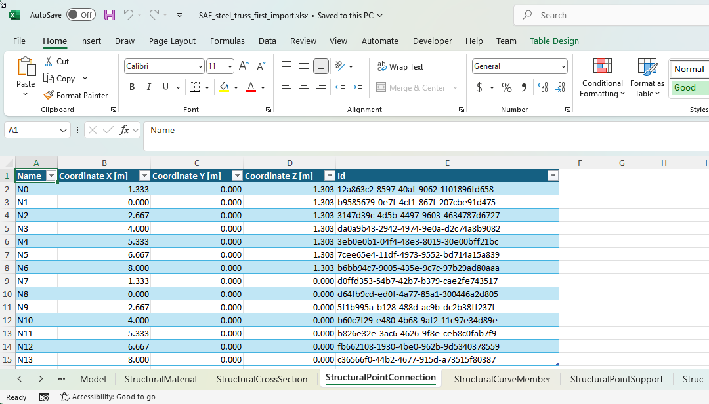

## Structural Analysis Format (SAF)

The below provides some information about SAF and why you may consider it as a transfer mechanism when creation a FEA Link with IDEA StatiCa Checkbot.

## What is Structural Analysis Format (SAF)

Information below has been copied from the [saf.guide website](https://www.saf.guide/en/stable/getting-started/what-is-saf.html) (24/10/2024)

SAF is an initiative from the Nemetschek Group to improve the collaboration between structural engineers by developing an open exchange format for exchanging data between structural analysis software based on the Excel format. It is focusing on a practical, easy to use, format that can be used in daily practice by structural engineers. It is meant as an open format and we look forward to you joining this initiative.

The structural analysis software companies participating in this initiative today are presented in chapter “Who supports SAF?”.

The coordination is currently managed by SCIA.

## Why use SAF for a Checkbot BIM LInk?

SAF has gained popularity as an industry open format to import and export structural analysis data to and from structural analysis applications. It is well documentated and also now supports the transferring of 1D Member analysis results.

IDEA StatiCa supports the import of the SAF analysis format (including results) and can convert this information to connections in IDEA StatiCa connections.

Some of our most used links are developed using it ([SCIA](https://www.ideastatica.com/bim/scia-engineer-steel), [FEM-Design](https://www.ideastatica.com/bim/fem-design)) as a way to transfer structural analysis data from FEA applications into IDEA StatiCa Checkbot, even though the user of the BIM Link will never know. 

## SAF Checkbot Bim link vs Standard BIM API link.  

When creating a BIM Link we always need an IDEA Open Model file to be created.

IDEA StatiCa provides a publicaly avaliable NuGet module to convert SAF to IOM. Therefore with a SAF link the conversion to IDEA Open Model is completed automatically and the developer does not need to understand the ins and outs of our IOM data model.

**SAF Link:** FEA App Data > **Export SAF** > Convert to IOM .xml (BimApi) > Import to Checkbot

**BIM API Link** FEA App Data > Convert to IOM .xml (BimApi) > Import to Checkbot

### Pros
* Significant reduction in the amount of link based code required. **If an existing SAF export is avaliable a BIM Link can be writen in a matter of hours!**
* Can provide general import/export value to customers wanting to transfer to all SAF supported software rather than just IDEA StatiCa.
* Support of an open standard. 
* As we improve our SAF conversion or SAF is developed further your link these will automatically be implemented in your link.

### Cons.

While it is a good option, there are also some possible reasons why a SAF BIM Link may not be a better option for your BIM Link.

* Not all IOM concepts are supported by SAF and vice-versa.
* Due to the file based nature of SAF, performance is slightly reduced. A direct API to model data will always provide a quicker import solution.
* Third-party developer will need to ensure persistant Guids of the exported SAF objects with internal objects.
* We do not support some SAF concepts however as we improve this, the BIM Link will also be improved.
