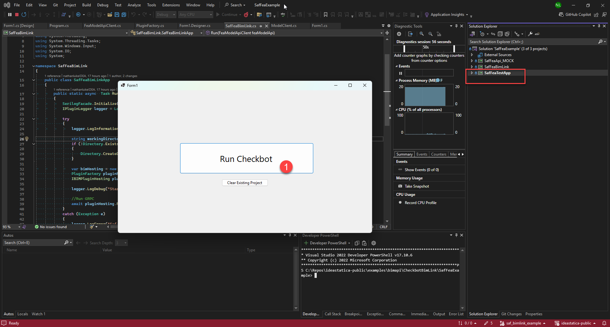
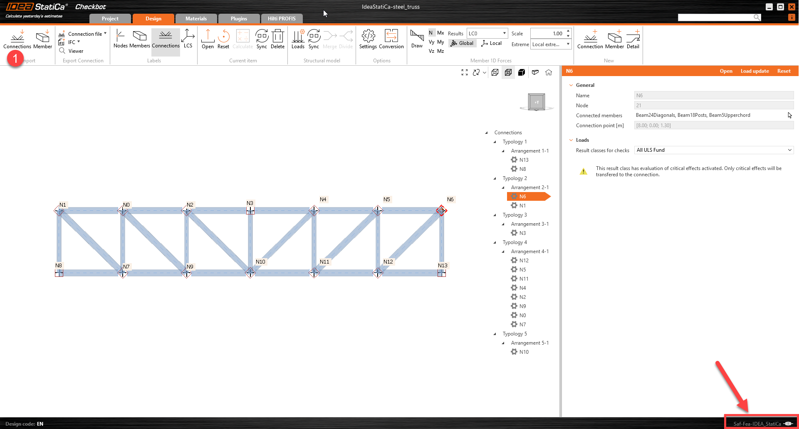

# FEA BIM Link (Using SAF) Example

## Intro

This example shows how to create a fully functioning BIM Link with IDEA StatiCa Checkbot and a FEA Application using our BimApiLink Framework and the Structural Analysis Format (SAF).

Before creating your own link we always encourage you to get in-touch with us to discuss co-operation.

### Structural Analysis Format (SAF)

If you are not aware of SAF or why you may use it to create a BIM Link with IDEA StatiCA Checkbot please read the the following document we provided on some of the considerations.
* [Why use SAF for a Checkbot BIM LInk?](what_is_SAF.md)

### API Requirements

To enable a fully functioning IDEA StatiCa Checkbot link there are some requirements required by the authoring FEA Application. In this examples we provide an MOCK (fake/simulated) API which describes the required communication that your application API needs to provide.

## Example

### Example requirements

- Visual Studio 2022 or Greater

### Building the example

1. Clone the [idea-statica/public](https://github.com/idea-statica/ideastatica-public) repository. Some typical instructions [here](https://docs.github.com/en/repositories/creating-and-managing-repositories/cloning-a-repository?tool=desktop).
2. In windows explorer navigate to the repository location `/examples/bimapi/CheckBotBimLink/SafFeaExample` folder and open the solution *SafFeaExample.sln* in visual studio.
3. Build the entire solution, which may take a minute or two. There should be no errors.

### Architecture (SafFeaExample.sln)

There are three main projects in the example solution:

1. **SafFeaBimLink** - The primary class library project which provides linking and conversion with the Checkbot application.  

> [!TIP]
> The SafFeaBimLink.cs file provides the primary entry method `Run()`.
> This method is the primary method which will be called from your application and starts communication with the base application and Checkbot.

2. **SafFeaApi_Mock** - A class library project which provides some dumby API Client calls. It is a Mock a typical API of an FEA software that could implement a link with SAF. 

> [!NOTE]
> When creating your own link this project should be replaced by a module which can communicate with your application.

3. **SafFeaTestApp** - Simple windows form app for running and testing the *SafFeaBimLink*. Implements the `Run()` command provided from the SafFeaBimLink public class. This test app includes some sample SAF files which are used for the initial import and syncing. Sample files are stored in the 'Inputs' folder of the project.

> [!NOTE]
> This is only used for demonstrating in the test enviroment. This app will be replaced on the third-party developers side with either another simple app runner or a command interface.

### Running the example (SafFeaTestApp)

This simple example will run Checkbot and allow you to import and sync some predefined SAF files with Member and Node objects.

> [!TIP] 
> Navigate to the example location and right click on the *SafFeaTestApp* and select set as start-up project.

1. Run the *SafFeaTestApp* project. A form should appear. 

> [!NOTE] 
> We are providing the filepath to the Checkbot executable in the `PluginFactory` class. This allows you to select which version of IDEA StatiCa you would like to run. For example: `C:\Program Files\IDEA StatiCa\StatiCa 24.0\IdeaCheckbot.exe`

2. Now we can click *Run Checkbot* in the Test App. This triggers the `SafFeaBimLink.Run()` command. 

> [!NOTE] 
> A new Checkbot project folder will automatically be created on the desktop. See the Mock API function which provides the directory of our MOCK Api model.

3. The new project screen will appear. You will be prompted to select a Country Code (Select **EU** for this example) and create the Checkbot project. 

> [!IMPORTANT]
> On creating the Checkbot project, a project file *IdeaStatiCa.proj* is saved into the checkbot folder. Next time checkbot is run it will detect this file and the project will be opened automatically where you left off. To reset the test, simply delete the created Checkbot folder. If you want to start from scratch again without closing the Test App **you can click the 'Clear existing project' in the form and it will delete the folder.**

4. Checkbot should now open to a blank screen. You will see in the bottom right hand corner the a link with your application is active.

> [!IMPORTANT]
> Notice the displayed name of the connected link 'Saf-Fea-IDEA_StatiCa'. This is driven from the SafFeaApplication Class in the FeaApplication.cs file. This should be updated when creating your own link.

5. In the top left hand corner of the ribbon, click **'Connections'**. This triggers the `GetSelection()` method in the 'ModelClient' class of *ModelClient.cs*. You can trace this back to the MOCK Api and understand the requirements of your application.

> [!IMPORTANT]
> In a functioning link the user would be required to perform a selection within the third-party app prior to selecting the Connections command. 

6. Checkbot will import the created SAF file.

6. We can now sync the model with an updated SAF file. In this case all the Member cross-sections have been changed to a smaller section. Click *'Sync'** under the structural model panel. This triggers the `GetObjects()` method in the 'ModelClient' class of *ModelClient.cs*. Again, you can trace this back to the MOCK Api and understand the requirements of your application.

> [!WARNING]
> You may notice a conversion dialogue appearing during the import or sync, if this is the case please select an equivalant section from the IDEA StatiCa catalogue to map with the imported one from SAF.

7. Members should be updated with the updated member sizes.

8. On closing of the test application or stopping debugging Checkbot will continue to run and vice-versa. Once the form application is closed the linking icon in the bottom right corner of Checkbot will be displayed as disconnected, meaning the connection has been lost. You are free to continue working on the project without the active connection.

**END OF EXAMPLE**

## Copying the example to create a new Link 

To start work on a link of your own, you can copy the SafFeaBimLink into a new solution or into your FEA project solution and rename it. You will need to bulk rename the namespace in the example. A typical naming structure is [AppName]IdeaLink but it can be anything of your choosing.

> [!IMPORTANT] 
> **It is also important to reconfigure the FEAApplication Names and logging references to your project naming.**

**SafFeaApi_Mock** should be replaced by a link your own API Model Library.

**SafFeaTestApp** should be replace by other small app or command interface which allows your program to host and run the link.

#### References

Required reference modules provided by IDEA StatiCA should be installed to your project via Nuget.

We also reccommend that you update to the latest NuGet packages avaliable.

#### Further Information 

Please comment in the [discussion forums](https://github.com/idea-statica/ideastatica-public/discussions/categories/bim-api-link-disscusion) if you require further clarification or information.