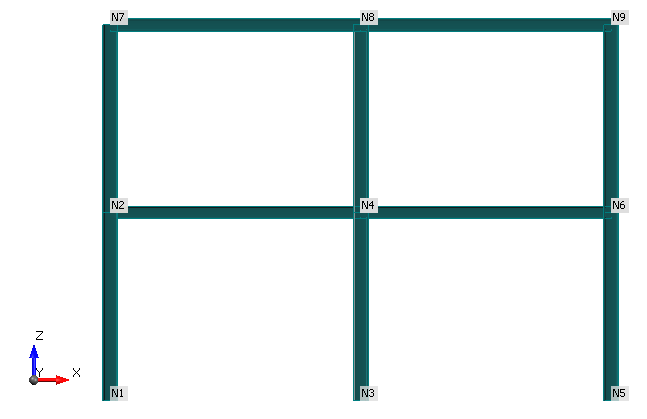
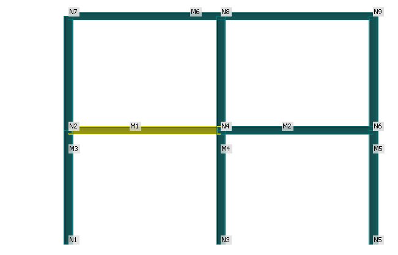

# Creating a simple IOM model with Python

This example runs through how a simple steel frame structure can be created using the IDEA Open Model (IOM) and Python.

This example follows along very similarly to the c# [steel frame example]()

## Define and reference IOM .dlls from the IDEA directory

Import required .dlls, including some system collections. We will reference the `IdeaRS.OpenModel` .dll from the IDEA installation path.

```python
import clr
import sys
import json
import math
import os

idea_path = "C:\Program Files\IDEA StatiCa\StatiCa 22.1"
sys.path.append(idea_path);

clr.AddReference("System.Collections")
from System.Collections.Generic import List

clr.AddReference("IdeaRS.OpenModel")
```

```python
#This allows us to quickly create the open Model Object
from IdeaRS.OpenModel import OpenModel

#This import allows us to quickly create objects which are referenced under the Open Model Namespace. 
from IdeaRS import OpenModel as IOM
```

## Create Open Model
Create the open model object to which we will start to add objects.

```python
model = OpenModel()
```

## Project settings
Basic information about our project - such as a project name, a description, etc. Specification of the project country code is also important. 

```python
originSettings = IOM.OriginSettings() 

originSettings.CrossSectionConversionTable = IOM.CrossSectionConversionTable.SCIA
originSettings.CountryCode = IOM.CountryCode.ECEN
originSettings.ProjectName = "Project"
originSettings.Author = "IDEA StatiCa s.r.o."
originSettings.ProjectDescription = "Training example"

model.OriginSettings = originSettings
```

## Definition of materials in the model

> Note that materials are code specific.


```python
material = IOM.Material.MatSteelEc2()

#set properties
material.Id = 1
material.Name = "S355"

#material.LoadFromLibrary = True;

material.E = 210000000000
material.G = material.E / (2 * (1 + 0.3))
material.Poisson = 0.3
material.UnitMass = 7850
material.SpecificHeat = 0.6
material.ThermalExpansion = 0.000012
material.ThermalConductivity = 45
material.IsDefaultMaterial = False
material.OrderInCode = 0
material.StateOfThermalExpansion = IOM.Material.ThermalExpansionState.Code
material.StateOfThermalConductivity = IOM.Material.ThermalConductivityState.Code
material.StateOfThermalSpecificHeat = IOM.Material.ThermalSpecificHeatState.Code
material.StateOfThermalStressStrain = IOM.Material.ThermalStressStrainState.Code
material.StateOfThermalStrain = IOM.Material.ThermalStrainState.Code
material.fy = 355000000
material.fu = 510000000
material.fy40 = 335000000
material.fu40 = 470000000
material.DiagramType = IOM.Material.SteelDiagramType.Bilinear

#add material to the model
model.AddObject(material);
```

## Definition of cross sections in the model
We will add two different I Shape cross sections to the model: HE200B and HE240B. To create a single cross-section we will reference the material created in the previous section. 

The IOM `ReferenceElement` is used to reference different objects to others in an IOM model. 

```python

# We can directly reference the material we create above as a reference element.

css1 = IOM.CrossSection.CrossSectionParameter()
css1.Id = 1;
css1.Name = "HE200B"
css1.Material =  IOM.ReferenceElement(material)
IOM.CrossSection.CrossSectionFactory.FillRolledI(css1, "HE200B")

css2 = IOM.CrossSection.CrossSectionParameter()
css2.Id = 2;
css2.Name = "HE240B"
css2.Material =  IOM.ReferenceElement(material)
IOM.CrossSection.CrossSectionFactory.FillRolledI(css2, "HE240B")

#add both cross-sections to the model
model.AddObject(css1)
model.AddObject(css2)
```

```python
# We can save our progress at any time using the `SaveToXmlFile()` method.

model.SaveToXmlFile('progressIOM.xml')
```

# Model Geometry



## Create Nodes

Table of all nodes with given coordinates:

|  Node  |  X  |  Y  |  Z  |
| ------ | --- | --- | --- |
|   N1   |  -2 |  3  |  0  |
|   N2   |  -2 |  3  |  3  |
|   N3   |  2  |  3  |  0  |
|   N4   |  2  |  3  |  3  |
|   N5   |  6  |  3  |  0  |
|   N6   |  6  |  3  |  3  |
|   N7   | -2  |  3  |  6  |
|   N8   |  2  |  3  |  6  |
|   N9   |  6  |  3  |  6  |


```python
# For ease I have created a List of List of Node Co-ordinates
nodes = [[-2,3,0],[-2,3,3],[2,3,0],[2,3,3],[6,3,0],[6,3,3],[-2,3,6],[2,3,6],[6,3,6]]

for i, pt in enumerate(nodes):
    Point = IOM.Geometry3D.Point3D()
    Point.X = nodes[i][0]
    Point.Y = nodes[i][1]
    Point.Z = nodes[i][2]
    Point.Name = "N{0}".format(i+1)
    Point.Id = i+1
    model.AddObject(Point)
    
```

## Add Members to the Model



Members are made up of one or more elements. Each element is to be created with a reference to a LineSegment3D. The LineSegment3D contains the local coordinate system of the member. **By default a Z-up coordinate system is defined for all Line Segments.**

### LineSegment3D

The local coordinate system of members
It its important to pay attantion to the correct setting of coordinate systems of members. It must correspond to coordinate systems which are used in your FEA model otherwise it can caused unbalanced internal forces in exported connections.


```python
# The `transformCoordsystem` input says whether the member should be assigned based on a standard vertical member axis system or not.

def CreateLineSegment3D(startNode, endNode, transformCoordSystem):
    
    segment3D = IOM.Geometry3D.LineSegment3D()
    
    segmentid = model.GetMaxId(segment3D) + 1
    segment3D.Id = segmentid
    
    st = next((x for x in model.Point3D if x.Id == startNode), None)
    end = next((x for x in model.Point3D if x.Id == endNode), None)
    segment3D.StartPoint = IOM.ReferenceElement(st)
    segment3D.EndPoint = IOM.ReferenceElement(end)

    if transformCoordSystem:
        system = IOM.Geometry3D.CoordSystemByPoint()
        pointref =  IOM.Geometry3D.Point3D()
        pointref.X = 100000
        pointref.Y = 0
        pointref.Z = 0
        system.Point = pointref
        system.InPlane = IOM.Geometry3D.Plane.ZX;
        segment3D.LocalCoordinateSystem = system;

    return segment3D;
```
### Member Helper Functions

Below are two helper functions that allow for the required elements of a member to be automatically created. The first helper function will create a member between two nodes only, while the second creates a continuous member with an intermediate node.

```python

#Creates a member with only a start and end point
def CreateSingleMember(memberType, startNode, endNode):
    member = IOM.Model.Member1D()
    
    columnLCS = False
    
    if memberType == "C":
        columnLCS = True
    
    #create line segment
    line = CreateLineSegment3D(startNode, endNode, columnLCS)
    model.AddObject(line)
    
    #create Element
    element = IOM.Model.Element1D()
    elementid = model.GetMaxId(element) + 1
    element.Id = elementid
    element.Name = "E{0}".format(elementid)
    element.Segment = IOM.ReferenceElement(line)
    
    model.AddObject(element)
    
    #assign Elements
    member.Elements1D.Add(IOM.ReferenceElement(element))
    
    return member
    
#Creates a member with a start an end and a middle point
def CreateDoubleMember(memberType, startNode, middleNode, endNode):
    member = IOM.Model.Member1D()
    
    columnLCS = False
    
    if memberType == "C":
        columnLCS = True                      
                          
    #create line segments
    line1 = IOM.Geometry3D.LineSegment3D()
    line2 = IOM.Geometry3D.LineSegment3D()
    
    line1 = CreateLineSegment3D(startNode, middleNode, columnLCS)
    model.AddObject(line1)
    
    line2 = CreateLineSegment3D(middleNode, endNode, columnLCS)
    model.AddObject(line2)
    
    #create Element 1
    element1 = IOM.Model.Element1D()
    elementid = model.GetMaxId(element1) + 1
    element1.Id = elementid
    element1.Name = "E{0}".format(elementid)
    element1.Segment = IOM.ReferenceElement(line1)
    
    model.AddObject(element1)
    
    #create Element 1
    element2 = IOM.Model.Element1D()
    elementid = model.GetMaxId(element2) + 1
    element2.Id = elementid
    element2.Name = "E{0}".format(elementid)
    element2.Segment = IOM.ReferenceElement(line2)
    
    model.AddObject(element2)
    
    #assign Elements
    member.Elements1D.Add(IOM.ReferenceElement(element1))
    member.Elements1D.Add(IOM.ReferenceElement(element2))
    
    return member
    
```

### Create Members

Using the helper functions defined above we will create and add members to the model based on the basic input provided below. Here the 'B' defined at the start of the list denotes a beam and the 'C' denotes a column. The Integers denote the start, intermediate (if any) and end nodes.

`[["B",2,4],["B",4,6],["C",1,2,7],["C",3,4,8],["C",5,6,9],["B",7,8,9]]`

```python

#For simplicity create a List of List of the Member Type and Start, Middle and End Nodes
memberNodeDefs = [["B",2,4],["B",4,6],["C",1,2,7],["C",3,4,8],["C",5,6,9],["B",7,8,9]]

#We can retrieve the appropriate cross-sections from the Model that we want to apply to the beams and columns respectively.
css_he_200b = next((x for x in model.CrossSection if x.Name == "HE200B"), None) 
css_he_240b = next((x for x in model.CrossSection if x.Name == "HE240B"), None) 

#create all members
for i, memberDef in enumerate(memberNodeDefs):
    memberType = memberDef[0]
    memberid = i+1
    
    member = IOM.Model.Member1D()
    
    if len(memberDef) < 4:
        member = CreateSingleMember(memberType, memberDef[1], memberDef[2])
    else:
        member = CreateDoubleMember(memberType, memberDef[1], memberDef[2], memberDef[3])  
    
    member.Name = "M{0}".format(i+1)
    member.Id = i+1
    
    if memberType == "C":
        member.Member1DType = IOM.Model.Member1DType.Column
        member.CrossSection = IOM.ReferenceElement(css_he_240b)
    else:
        member.Member1DType = IOM.Model.Member1DType.Beam
        member.CrossSection = IOM.ReferenceElement(css_he_200b)
        
    model.AddObject(member)
```

## Loading of the Steel Frame


### Define Load Groups and Load Cases

```python
# Create the load group for permanent load cases
LG1 = IOM.Loading.LoadGroupEC()
LG1.Id = 1
LG1.Name = "PERM1"
LG1.Relation = IOM.Loading.Relation.Standard
LG1.GroupType = IOM.Loading.LoadGroupType.Permanent
LG1.GammaQ = 1.35
LG1.Dzeta = 0.85
LG1.GammaGInf = 1
LG1.GammaGSup = 1.35
model.AddObject(LG1)

# Create the second load group for variable loadcases
LG2 = IOM.Loading.LoadGroupEC()
LG2.Id = 2;
LG2.Name = "VAR1";
LG2.Relation = IOM.Loading.Relation.Exclusive;
LG2.GroupType = IOM.Loading.LoadGroupType.Variable;
LG2.GammaQ = 1.5;
LG2.Dzeta = 0.85;
LG2.GammaGInf = 0;
LG2.GammaGSup = 1.5;
LG2.Psi0 = 0.7;
LG2.Psi1 = 0.5;
LG2.Psi2 = 0.3;
model.AddObject(LG2);


# Create the first load case representing SelfWeight
LC1 = IOM.Loading.LoadCase()

LC1.Id = 1
LC1.Name = "SelfWeight"
LC1.LoadType = IOM.Loading.LoadCaseType.Permanent
LC1.Type = IOM.Loading.LoadCaseSubType.PermanentStandard
LC1.Variable = IOM.Loading.VariableType.Standard
LC1.LoadGroup = IOM.ReferenceElement(LG1)

# Create the second load case representing Pernament Loading
LC2 = IOM.Loading.LoadCase()

LC2.Id = 2
LC2.Name = "PernamentLoading"
LC2.LoadType = IOM.Loading.LoadCaseType.Permanent
LC2.Type = IOM.Loading.LoadCaseSubType.PermanentStandard
LC2.Variable = IOM.Loading.VariableType.Standard
LC2.LoadGroup = IOM.ReferenceElement(LG1)

# Create the third load case representing LiveLoad
LC3 = IOM.Loading.LoadCase()

LC3.Id = 3
LC3.Name = "LiveLoad"
LC3.LoadType = IOM.Loading.LoadCaseType.Variable
LC3.Type = IOM.Loading.LoadCaseSubType.VariableStatic
LC3.Variable = IOM.Loading.VariableType.Standard
LC3.LoadGroup = IOM.ReferenceElement(LG2)

# Add load cases to the model
model.AddObject(LC1);
model.AddObject(LC2);
model.AddObject(LC3);
```

### Define Load Combinations


```python
# create first combination input
CI1 = IOM.Loading.CombiInputEC()

CI1.Id = model.GetMaxId(CI1) + 1
CI1.Name = "Co.#1"
CI1.Description = "SelfWeight + PernamentLoading + LiveLoad"
CI1.TypeCombiEC = IOM.Loading.TypeOfCombiEC.ULS
CI1.TypeCalculationCombi = IOM.Loading.TypeCalculationCombiEC.Linear

item = IOM.Loading.CombiItem()
item.Id = 1;
item.Coeff = 1.35;
item.LoadCase = IOM.ReferenceElement(next((x for x in model.CrossSection if x.Name == "SelfWeight"), None));
CI1.Items.Add(item);

item = IOM.Loading.CombiItem();
item.Id = 2;
item.Coeff = 1.35;
item.LoadCase = IOM.ReferenceElement(next((x for x in model.CrossSection if x.Name == "PernamentLoading"), None));
CI1.Items.Add(item);

item = IOM.Loading.CombiItem();
item.Id = 3;
item.Coeff = 1.5;
item.LoadCase = IOM.ReferenceElement(next((x for x in model.CrossSection if x.Name == "LiveLoad"), None));
CI1.Items.Add(item);

model.AddObject(CI1);

#create second combination input
CI2 = IOM.Loading.CombiInputEC()

CI2.Id = model.GetMaxId(CI2) + 1
CI2.Name = "Co.#2"
CI2.Description = "SelfWeight"
CI2.TypeCombiEC = IOM.Loading.TypeOfCombiEC.ULS
CI2.TypeCalculationCombi = IOM.Loading.TypeCalculationCombiEC.Linear

item = IOM.Loading.CombiItem();
item.Id = 1;
item.Coeff = 1;
item.LoadCase = IOM.ReferenceElement(next((x for x in model.CrossSection if x.Name == "SelfWeight"), None));
CI2.Items.Add(item);

model.AddObject(CI2);
```

## IOM Model Results

We will not define the results here but results can also be created using this means. We will reference a previously defined result file for this example. You can find some further information here:

https://github.com/idea-statica/ideastatica-public/tree/main/src/Examples/IOM

Congratulations, you have created an IOM Model from Scratch. Now let's define a Connection Point to allow us to import into IDEA StatiCa Connection.

# Define a Connection within the Model

Now that the model has been created we should define a connection point and add the relevant members to it. A connection is defined by its reference node and connected members. A member can be ended or continuous.

```python
# create a connection point
CP1 = IOM.Connection.ConnectionPoint()

CP1.Node = IOM.ReferenceElement(next((x for x in model.Point3D if x.Name == "N2"), None));
conId = model.GetMaxId(CP1) + 1;
CP1.Id = conId;
CP1.Name = "CON {0}".format(conId);

# members from the previous section
# Let's get the members we want to connect in the connection. These will be M1 and M3. M3 will be continuous in the Connection while M1 will be ended.

connectedMem1 = IOM.Connection.ConnectedMember()
connectedMem1.IsContinuous = False;
connectedMem1.Id = 1;
connectedMem1.MemberId = IOM.ReferenceElement(next((x for x in model.Member1D if x.Name == "M1"), None))

connectedMem3 = IOM.Connection.ConnectedMember()
connectedMem3.IsContinuous = True;
connectedMem3.Id = 3;
connectedMem3.MemberId = IOM.ReferenceElement(next((x for x in model.Member1D if x.Name == "M3"), None))

CP1.ConnectedMembers.Add(connectedMem1);
CP1.ConnectedMembers.Add(connectedMem3);

model.AddObject(CP1);
```

## Defining the ConnectionData
We can now add additional connection data such as beam information, Plate, Bolt, Weld, and Cut information. We will only add some basic beam information here. Further information on adding additional info is explained here: https://github.com/idea-statica/ideastatica-public/tree/main/src/Examples/IOM 

```python
conData = IOM.Connection.ConnectionData()

beamData = List[IOM.Connection.BeamData]()

beamData1 = IOM.Connection.BeamData()
beamData1.Id = 1
beamData1.Name = "M1"
beamData1.OriginalModelId = "1"

beamData2 = IOM.Connection.BeamData()
beamData2.Id = 3
beamData2.Name = "M3"
beamData2.OriginalModelId = "3"

beamData.Add(beamData1)
beamData.Add(beamData2)

conData.Beams = beamData

model.Connections.Add(conData)

```
## Saving the Model

Let's save the final model to drive.

```python
model.SaveToXmlFile('IOM-SteelFrame.xml')
```
Congratulations, you have successfully created an IOM model and a connection point that can be imported into IDEA StatiCa Connection.
